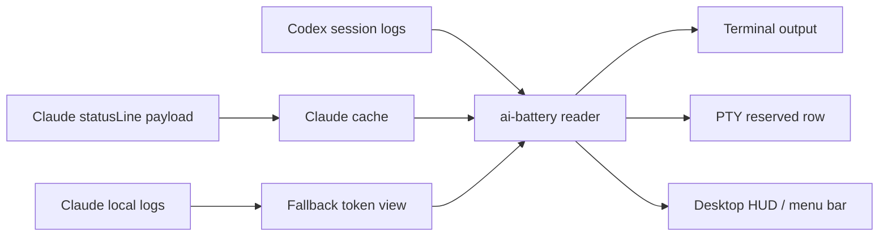

# AI Battery

[한국어](README.md) · [English](README.en.md) · [日本語](README.ja.md) · [中文](README.zh.md) · [Español](README.es.md)

Codex and Claude Usage Battery Meter

A terminal status display tool that shows the remaining Codex and Claude Code usage like a battery.


[Install](#install) · [Features](#features) · [Quick Start](#quick-start) · [Claude StatusLine](#claude-statusline) · [Desktop HUD](#desktop-hud) · [Caution](#caution)

## Overview

`ai-battery` is a small status display tool for keeping an eye on remaining usage and reset times while using Codex and Claude Code.

For Codex, it reads `rate_limits` events from local session logs. For Claude Code, it caches the rate-limit payload delivered by the `statusLine` hook. When Claude records an actual 429 rate-limit hit, that limit is shown as 0% until the corresponding reset time. The default output stays compact on one line: running tools are shown in white, inactive tools in gray, and only the battery bar changes color based on remaining usage: green, orange, or red.


The Markdown text fallback omits the bar to avoid renderer-specific differences in block character height. In a real terminal, ANSI colors and block bars are rendered together.

```text
Codex 86% │ 5h 18:09 │ 7d 82%  ┃  Claude 4% │ 5h 18:10 │ 7d 71%
```

| Provider | Source | Shows |
| --- | --- | --- |
| Codex | `~/.codex/sessions/**/*.jsonl` | 5h remaining, 5h reset time, 7d remaining |
| Claude Code | Claude `statusLine` payload cache + 429 hit logs | 5h remaining, 5h reset time, 7d remaining |
| Claude fallback | `~/.claude/projects/**/*.jsonl` | Recent turn token usage |

## Features

| Feature | Description |
| --- | --- |
| Shared usage display | Shows Codex and Claude Code usage in the same format. |
| Reset time display | Shows `5h` and `7d` window labels and values. |
| Color thresholds | Highlights only the battery: green above 40%, orange from 21-40%, and red at 20% or below. |
| Codex terminal row | Provides a PTY wrapper that pins a dedicated usage row under Codex. |
| Claude statusLine | Reads Claude rate-limit state from Claude Code's built-in statusLine hook and actual 429 hit logs. |
| HUD / menu bar | Provides a floating HUD on Windows native/WSL and a menu bar status item on macOS. |
| npm execution | Can be run with `npm install -g` or `npx`. |

## Platform Support

| Mode | Windows native | WSL | Linux | macOS | Note |
| --- | --- | --- | --- | --- | --- |
| `ai-battery` | Supported | Supported | Supported | Supported | Requires Node.js 18 or newer. |
| `ai-battery --watch` | Supported | Supported | Supported | Supported | Refreshes periodically inside the terminal. |
| Claude statusLine | Supported | Supported | Supported | Supported | Saves a `node <script>` command to Claude Code `statusLine`. |
| Codex terminal row | Supported | Supported | Supported | Supported | On Windows, reserves a bottom row when `rowpty.exe` (the dedicated ConPTY host) is available; otherwise it uses an overlay row drawn in the same console. WSL/Linux/macOS use POSIX PTY and `python3`. |
| `ai-battery setup codex` | Supported | Supported | Supported | Supported | Configures Codex `[tui].status_line` and installs a `codex.cmd` wrapper on Windows or a POSIX shell wrapper on WSL/Linux/macOS. |
| `ai-battery hud` | Supported | Supported | Unsupported | Supported | Windows/WSL use a PowerShell/WinForms HUD; macOS uses a menu bar status item. |

Runtime detection uses `/proc` on Linux/WSL, `ps` on macOS, and PowerShell process listings on Windows. Text output uses white/gray, while the macOS HUD highlights only running items with colored battery bars and shows inactive items in muted gray.

## Install

```bash
npm install -g ai-battery
```

You can also run it immediately without installing.

```bash
npx ai-battery
```

The previous command names, `claudex-battery`, `claudex-battery-run`, and `claudex-battery-hud`, are still provided as compatibility aliases.

## Quick Start

1. Install the package.

   ```bash
   npm install -g ai-battery
   ```

2. Set up automatic display for Claude and Codex.

   ```bash
   ai-battery setup
   ```

3. After that, keep using the original commands as usual.

   ```bash
   claude
   codex
   ```

4. Start the desktop HUD or macOS menu bar display when you need it.

   ```bash
   ai-battery hud
   ```

## CLI

```bash
ai-battery
ai-battery --watch 10
ai-battery --json
ai-battery --version
ai-battery --provider codex
ai-battery --provider claude
ai-battery setup
ai-battery uninstall
ai-battery doctor
ai-battery hud
ai-battery off codex
ai-battery on codex
```

| Option | Description |
| --- | --- |
| `--provider all\|codex\|claude` | Chooses which provider to show. |
| `--watch [seconds]` | Refreshes periodically on the same line. |
| `--json` | Outputs JSON that is convenient for HUDs or other tools. |
| `--bar-width N` | Adjusts the terminal battery bar width. |
| `--show-paths` | Shows log file paths and data observation timestamps. |
| `-v`, `--version` | Prints the installed `ai-battery` version. |

`doctor` checks the installation state and the latest npm version. If the network is unavailable, only the version check is skipped and the rest of the diagnostics are still shown.

## Uninstall

`off` only hides the display. `uninstall` removes the integration points created by `setup` and HUD autostart.

```bash
ai-battery uninstall
```

You can remove only part of the integration as well.

```bash
ai-battery uninstall codex
ai-battery uninstall claude
ai-battery uninstall hud
```

This command cleans up the Codex wrapper managed by AI Battery, Codex `[tui].status_line`, Claude `statusLine`, HUD/menu bar autostart, and any running HUD. It does not touch a `codex` file created by another tool or a Claude `statusLine` created elsewhere. If the Codex config was edited by the user after setup, it is left intact. If older versions or `--force` created backups, the command restores the original file or symlink when possible. The terminal row in a Codex session that is already running inside the AI Battery wrapper disappears only after that session exits.

Modern npm does not run the package uninstall lifecycle, so `npm uninstall ai-battery` or `npm uninstall -g ai-battery` alone cannot automatically clean up external integration points. To remove everything, run this before deleting the npm package.

```bash
ai-battery uninstall
npm uninstall -g ai-battery
```

If you already removed the npm package first, install it again and run `ai-battery uninstall`, or manually check and remove these items: the Codex wrapper created by AI Battery, the `# >>> ai-battery setup >>>` block in shell rc files, Codex `~/.codex/config.toml` `[tui].status_line`, Claude `statusLine`, and HUD/menu bar autostart.

## Setup

Run `setup` once. It installs a statusLine hook for Claude Code and sets up Codex with a default status line plus a platform wrapper, so you can keep launching the original commands afterward.

```bash
ai-battery setup
```

You can configure only one side if needed.

```bash
ai-battery setup claude
ai-battery setup codex
```

Codex setup configures `model-with-reasoning`, `current-dir`, and `git-branch` status line entries under `[tui]` in `~/.codex/config.toml`. Existing values are backed up for uninstall recovery. The Codex wrapper does not directly overwrite the existing `codex` command. If `~/.local/bin` already appears before the original `codex` on PATH and `~/.local/bin/codex` is empty or managed by AI Battery, the wrapper is placed there so it is picked up immediately. Otherwise, a managed wrapper is created at `~/.local/share/ai-battery/bin/codex`, and this directory is prepended to PATH in shell configuration when needed. If a shared location such as `~/.local/bin/codex` already contains another file, it is not overwritten. New terminals will automatically run `codex` with the AI Battery bottom row. If you already ran `codex` in the same terminal, the shell command cache may require one `hash -r`; if PATH needs to be updated, run the `source ...` command printed by `setup`.

On Windows native `cmd`/PowerShell, the `codex.cmd` wrapper runs the Windows runner. When `rowpty.exe` (the dedicated ConPTY host from the separate rowpty project) is available, the runner reserves a bottom row just like WSL: the child program uses a screen that is one line shorter, and the status line is drawn only when output is quiet, so it stays pinned at the bottom without flicker. `rowpty.exe` is not distributed as a binary. `ai-battery setup` compiles the bundled source (`vendor/rowpty/RowPty.cs`) on the user's machine with the Windows built-in .NET Framework `csc.exe`, installs it into `%LOCALAPPDATA%\ai-battery\bin`, and places Microsoft-signed ConPTY components (`conpty.dll`/`OpenConsole.exe`, copied from the node-pty package) next to it. To avoid delaying Codex startup, the default runtime uses the Windows built-in OS ConPTY; set `AI_BATTERY_ROWPTY_CONPTY=bundled` to return to the bundled provider. Because there is no unsigned downloaded binary, SmartScreen/Defender reputation warnings are avoided at the source, and the text source can be inspected. To use your own built exe, point `AI_BATTERY_ROWPTY` at it. Without rowpty, the runner falls back to an overlay layout drawn in the same console (`AI_BATTERY_WIN_LAYOUT=overlay` can force it); the legacy `node-pty` reserve mode is used only when `AI_BATTERY_WIN_LAYOUT=reserve` is set and rowpty is unavailable. Claude statusLine appears only inside Claude Code, not in a regular `cmd`/PowerShell prompt.

In tmux, reserving a bottom row in every pane would duplicate the same global battery as many times as there are panes. Instead, you can show it once per session in the tmux status bar.

```bash
ai-battery setup tmux
```

This adds a managed block to `~/.tmux.conf`, displays the battery in `status-right` with a 10-second refresh interval, and lets `codex` inside tmux use the full pane instead of adding a per-pane battery row. Claude statusLine also collapses the battery row in the same environment and shows only the header row (model, directory, branch), because the battery is already in the tmux bar. To apply it, run `tmux source-file ~/.tmux.conf` and open a new pane. This block overwrites the existing `status-right` setting, so it is opt-in and not included in `setup all`. Remove it with `ai-battery uninstall tmux`; set `AI_BATTERY_TMUX=row` if you want to keep per-pane rows inside tmux. Claude statusLine is part of the Claude Code internal UI, so it is displayed regardless of tmux.

Run diagnostics if the Codex bottom row does not appear.

```bash
ai-battery doctor
```

Use the short on/off commands to choose which providers are shown.

```bash
ai-battery off codex
ai-battery on codex
ai-battery off claude
ai-battery on claude
ai-battery off all
ai-battery on all
```

This setting applies to the CLI, Claude statusLine, Codex wrapper, and HUD together.

## Codex Terminal Row

`ai-battery setup` configures Codex's own status line as `model/reasoning effort · workspace · git branch`. Usage display is handled by a separate `codex` wrapper, so users can type `codex` as usual and `ai-battery-run` runs Codex inside a PTY that is one line shorter.

```bash
codex
```

Advanced users who need to run the wrapper directly can use this command.

```bash
ai-battery-run --provider all codex
```

Use `--interval` to reduce the refresh interval.

```bash
ai-battery-run --interval 1 --provider all codex
```

## Claude StatusLine

Claude Code provides rate-limit usage and reset times through the built-in `statusLine` hook. AI Battery combines that with actual 429 rate-limit hit records from Claude JSONL. After installation, Claude renders two lines.


```text
Opus high · ~/Projects · main                               83% context left
Codex 71% │ 5h 00:47 │ 7d 90%  Claude 76% │ 5h 00:47 │ 7d 59%
```

The first line shows the model, reasoning level, workspace root, and git branch, with remaining Claude context pinned to the right edge. The second line shows Codex and Claude usage in the same format.

Setup:

```bash
ai-battery setup claude
```

Remove:

```bash
ai-battery uninstall-claude-statusline
```

Claude must deliver a statusLine payload at least once before the Claude usage cache is created. Until then, the Claude local log fallback is shown.

## Desktop HUD

Drawing a status line safely over a normal terminal from an external process is not reliable. AI Battery therefore provides a floating overlay on Windows and a top menu bar status item on macOS. On Windows native, it runs directly through PowerShell/WinForms without WSL; from WSL, it launches the same HUD through `powershell.exe`. On macOS, it displays Codex and Claude logos, compact meters, and percentages as a small SVG image with a transparent background. Click it to see detailed status.

```bash
ai-battery hud
```

The HUD runs in the background and immediately returns control to the terminal. The Windows HUD can be moved by dragging, and the saved position is reused on the next launch. The macOS menu bar item appears in the right side of the system menu bar.

```text
Codex  [battery:88] │ 5h 00:47 │ 7d 93%
Claude [battery:76] │ 5h 00:47 │ 7d 59%
```

| Command | Role |
| --- | --- |
| `ai-battery hud` / `ai-battery hud start` | Starts the Windows floating HUD or macOS menu bar item. |
| `ai-battery hud stop` | Stops the running HUD/menu bar item. (`--stop` is the same.) |
| `ai-battery hud status` | Shows whether the HUD/menu bar item is running and whether autostart is registered. |
| `ai-battery hud autostart on` | Registers automatic startup on Windows login or macOS login. |
| `ai-battery hud autostart off` | Removes automatic startup registration. |
| `ai-battery hud autostart status` | Shows only autostart registration status. |
| `ai-battery hud -Foreground` | Runs attached to the terminal for debugging. |
| `ai-battery hud -Once` | Prints once in the console. |
| `ai-battery hud -Interval 2` | Changes the refresh interval. |
| `ai-battery hud -Mode tray` | Runs in Windows tray icon mode. On macOS, the menu bar item is the default. |
| `ai-battery hud light` / `ai-battery hud dark` | Switches the Windows floating HUD to black text for a light taskbar or white text for a dark taskbar. |
| `ai-battery hud black` / `ai-battery hud white` | Sets the text color directly to black or white. |
| `ai-battery hud --backdrop` / `ai-battery hud --no-backdrop` | Enables or disables the dark backing behind Windows floating HUD text. |

The Windows floating HUD defaults to bright text on a transparent background. Use `ai-battery hud light` for a light taskbar or `ai-battery hud dark` for a dark taskbar. To pick the text color directly, use `ai-battery hud black` or `ai-battery hud white`. Add the same mode when saving login autostart, such as `ai-battery hud autostart on light`.

Windows autostart is registered per user under `HKCU\Software\Microsoft\Windows\CurrentVersion\Run`. On Windows native it runs directly without WSL, and when registered from WSL a copy of the HUD script is placed under `%LOCALAPPDATA%\ai-battery`. macOS autostart is registered as `~/Library/LaunchAgents/com.ai-battery.hud.plist`. After updating ai-battery, run `ai-battery hud autostart on` again to refresh the registered path.

## Shell Prompt

You can also add it to your shell prompt.

```bash
export PS1='$(ai-battery --provider codex) '"$PS1"
```

The prompt method refreshes every time a command runs. Use `ai-battery setup` or `ai-battery hud` if you want a persistent display.

## How It Works



Codex looks for `rate_limits` events in recent session logs. Claude Code provides usage and reset times through the statusLine payload, and actual 429 rate-limit hit logs are reflected as 0% until reset. In fallback mode, only recent token usage can be checked.

## Tech Stack

| Layer | Technology | Role |
| --- | --- | --- |
| CLI | Node.js | Log parsing, Claude cache, ANSI/statusLine output |
| PTY row | Python 3 | Reserved terminal row for running Codex |
| HUD launcher | Node.js / Bash compatibility wrapper | Launches the Windows native/WSL PowerShell HUD and macOS menu bar |
| HUD UI | PowerShell WinForms / AppleScriptObjC | Windows floating overlay, tray icon, macOS menu bar item |
| Data | JSONL logs, statusLine JSON | Codex/Claude usage sources |

## Source Environment

The default CLI runs on Windows native, WSL, Linux, and macOS when Node.js 18 or newer is available. On Windows native, the Codex terminal row uses a reserved row when `rowpty.exe` is available (a dedicated ConPTY host built with the .NET Framework 4.8 built-in csc.exe), otherwise it falls back to the Node runner's same-console overlay row. On WSL/Linux/macOS, `ai-battery-run` uses Python 3 and POSIX PTY. The HUD uses PowerShell/WinForms on Windows/WSL and built-in `osascript` with AppleScriptObjC on macOS.

Codex data is read from `~/.codex/sessions` by default. Set `CODEX_HOME` if you use a different location.

```bash
CODEX_HOME=/path/to/codex-home ai-battery --provider codex
```

Claude usage display becomes available after installing the Claude Code statusLine hook.

## Caution

- This tool reads local logs and Claude statusLine payloads. It does not replace the service's official billing or limit screen.
- If Codex rate-limit events have not been created yet or are stale, the display may differ from the latest state.
- Claude statusLine provides only usage and reset times, so actual hit state is combined with 429 rate-limit logs left by Claude.
- The HUD is based on PowerShell/WinForms on Windows and a menu bar status item on macOS. On WSL, it uses both `powershell.exe` and `wsl.exe`.
- `ai-battery-run` is a PTY wrapper. Some full-screen TUIs may briefly disturb the status row because of screen-clearing escape sequences.
