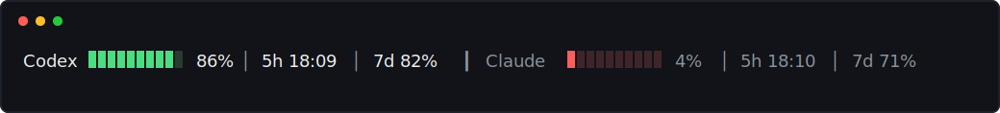
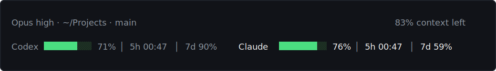
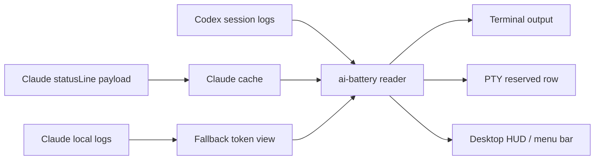

# AI Battery

[한국어](README.md) · [English](docs/i18n/en/) · [日本語](docs/i18n/ja/) · [中文](docs/i18n/zh/) · [Español](docs/i18n/es/)

Codex and Claude Usage Battery Meter

Codex와 Claude Code의 남은 사용량을 배터리처럼 확인하는 터미널 상태 표시 도구입니다.


[Install](#install) · [Features](#features) · [Quick Start](#quick-start) · [Claude StatusLine](#claude-statusline) · [Desktop HUD](#desktop-hud) · [Caution](#caution)

## Overview

`ai-battery`는 Codex와 Claude Code를 사용하면서 남은 사용량과 리셋 시간을 계속 확인하기 위한 작은 상태 표시 도구입니다.

Codex는 로컬 세션 로그의 `rate_limits` 이벤트를 읽고, Claude Code는 `statusLine` hook이 전달하는 rate-limit payload를 캐시해서 사용합니다. Claude가 실제 429 rate-limit hit를 기록한 경우에는 해당 reset 전까지 그 제한을 0%로 반영합니다. 기본 출력은 한 줄로 작게 유지되며, 실행 중인 도구는 흰색, 실행 중이지 않은 도구는 회색으로 표시합니다. 배터리 바 색상만 잔량에 따라 초록, 주황, 빨강으로 바뀝니다.



Markdown의 텍스트 fallback은 렌더러별 블록 문자 높이 차이를 피하려고 바를 생략합니다. 실제 터미널에서는 ANSI 색상과 블록 바가 함께 렌더링됩니다.

```text
Codex 86% │ 5h 18:09 │ 7d 82%  ┃  Claude 4% │ 5h 18:10 │ 7d 71%
```

| Provider | Source | Shows |
| --- | --- | --- |
| Codex | `~/.codex/sessions/**/*.jsonl` | 5h 잔량, 5h 리셋 시각, 7d 잔량 |
| Claude Code | Claude `statusLine` payload cache + 429 hit logs | 5h 잔량, 5h 리셋 시각, 7d 잔량 |
| Claude fallback | `~/.claude/projects/**/*.jsonl` | 최근 턴 토큰 사용량 |

## Features

| Feature | Description |
| --- | --- |
| 공통 사용량 표시 | Codex와 Claude Code 사용량을 같은 형식으로 표시합니다. |
| 리셋 시각 표시 | `5h`, `7d` 창 라벨과 값을 표시합니다. |
| 색상 기준 | 40% 초과 초록, 21-40% 주황, 20% 이하 빨강으로 배터리만 강조합니다. |
| Codex terminal row | Codex 아래에 별도 사용량 행을 고정하는 PTY wrapper를 제공합니다. |
| Claude statusLine | Claude Code 내장 statusLine hook과 실제 429 hit 로그로 Claude rate limit 상태를 읽습니다. |
| HUD / menu bar | Windows native/WSL에서는 floating HUD, macOS에서는 menu bar status item을 제공합니다. |
| npm 실행 | `npm install -g` 또는 `npx`로 실행할 수 있습니다. |

## Platform Support

| Mode | Windows native | WSL | Linux | macOS | Note |
| --- | --- | --- | --- | --- | --- |
| `ai-battery` | 지원 | 지원 | 지원 | 지원 | Node.js 18 이상이 필요합니다. |
| `ai-battery --watch` | 지원 | 지원 | 지원 | 지원 | 터미널 안에서 주기적으로 갱신합니다. |
| Claude statusLine | 지원 | 지원 | 지원 | 지원 | Claude Code `statusLine`에 `node <script>` 명령을 저장합니다. |
| Codex terminal row | 지원 | 지원 | 지원 | 지원 | Windows는 `rowpty.exe`(전용 ConPTY host)가 있으면 하단 row를 예약하고, 없으면 같은 콘솔에 덧그리는 overlay row로 동작합니다. WSL/Linux/macOS는 POSIX PTY와 `python3`를 사용합니다. |
| `ai-battery setup codex` | 지원 | 지원 | 지원 | 지원 | Codex `[tui].status_line`을 맞추고, Windows는 `codex.cmd` wrapper, WSL/Linux/macOS는 POSIX shell wrapper를 설치합니다. |
| `ai-battery hud` | 지원 | 지원 | 미지원 | 지원 | Windows/WSL은 PowerShell/WinForms HUD, macOS는 menu bar status item입니다. |

실행 중 감지는 Linux/WSL은 `/proc`, macOS는 `ps`, Windows는 PowerShell 프로세스 목록을 사용합니다. 텍스트 출력은 흰색/회색으로, macOS HUD는 실행 중인 항목만 색상 배터리바로 강조하고 비실행 항목은 흐린 회색 계열로 표시합니다.

## Install

```bash
npm install -g ai-battery
```

설치하지 않고 바로 실행할 수도 있습니다.

```bash
npx ai-battery
```

이전 이름인 `claudex-battery`, `claudex-battery-run`, `claudex-battery-hud` 명령도 호환 alias로 함께 제공됩니다.

## Quick Start

1. 패키지를 설치합니다.

   ```bash
   npm install -g ai-battery
   ```

2. Claude와 Codex 자동 표시를 설정합니다.

   ```bash
   ai-battery setup
   ```

3. 이후에는 원래 명령을 그대로 사용합니다.

   ```bash
   claude
   codex
   ```

4. 데스크톱 HUD나 macOS menu bar 표시가 필요하면 실행합니다.

   ```bash
   ai-battery hud
   ```

## CLI

```bash
ai-battery
ai-battery --watch 10
ai-battery --json
ai-battery --version
ai-battery --provider codex
ai-battery --provider claude
ai-battery setup
ai-battery uninstall
ai-battery doctor
ai-battery hud
ai-battery off codex
ai-battery on codex
```

| Option | Description |
| --- | --- |
| `--provider all\|codex\|claude` | 표시할 provider를 선택합니다. |
| `--watch [seconds]` | 같은 줄에서 주기적으로 갱신합니다. |
| `--json` | HUD나 다른 도구에서 쓰기 좋은 JSON을 출력합니다. |
| `--bar-width N` | 터미널 배터리 바 길이를 조정합니다. |
| `--show-paths` | 로그 파일 경로와 데이터 관측 시각을 함께 표시합니다. |
| `-v`, `--version` | 설치된 `ai-battery` 버전을 출력합니다. |

`doctor`는 설치 상태와 함께 npm latest 버전을 확인합니다. 네트워크가 막혀 있으면 버전 확인만 건너뛰고 나머지 진단은 계속 표시합니다.

## Uninstall

`off`는 표시만 숨기는 설정이고, `uninstall`은 `setup`과 HUD autostart가 만든 통합 지점을 제거합니다.

```bash
ai-battery uninstall
```

일부만 제거할 수도 있습니다.

```bash
ai-battery uninstall codex
ai-battery uninstall claude
ai-battery uninstall hud
```

이 명령은 AI Battery가 관리 마커를 넣은 Codex wrapper, Codex `[tui].status_line`, Claude `statusLine`, HUD/menu bar autostart와 실행 중인 HUD를 정리합니다. 다른 도구가 만든 `codex` 파일이나 Claude `statusLine`은 건드리지 않습니다. Codex config가 setup 이후 사용자가 수정한 상태라면 안전하게 그대로 둡니다. 이전 버전이나 `--force`로 기존 파일을 백업한 경우에는 가능한 한 원래 파일/symlink를 복원합니다. 현재 이미 AI Battery wrapper 안에서 실행 중인 Codex 세션의 terminal row는 그 세션을 종료해야 사라집니다.

최신 npm은 패키지의 uninstall lifecycle을 실행하지 않기 때문에 `npm uninstall ai-battery` 또는 `npm uninstall -g ai-battery`만으로는 외부 통합 지점을 자동 정리할 수 없습니다. 완전히 제거하려면 npm 패키지를 지우기 전에 먼저 실행하세요.

```bash
ai-battery uninstall
npm uninstall -g ai-battery
```

이미 npm 패키지를 먼저 지운 뒤라면, 다시 설치한 다음 `ai-battery uninstall`을 실행하거나 아래 항목을 직접 확인해 제거해야 합니다: AI Battery가 만든 Codex wrapper, shell rc의 `# >>> ai-battery setup >>>` block, Codex `~/.codex/config.toml`의 `[tui].status_line`, Claude `statusLine`, HUD/menu bar autostart.

## Setup

`setup`은 한 번만 실행합니다. Claude Code에는 statusLine hook을 설치하고, Codex에는 기본 status line 구성과 platform wrapper를 설치해서 이후에는 추가 명령 없이 원래처럼 실행하게 합니다.

```bash
ai-battery setup
```

일부만 설정할 수도 있습니다.

```bash
ai-battery setup claude
ai-battery setup codex
```

Codex setup은 `~/.codex/config.toml`의 `[tui]`에 `model-with-reasoning`, `current-dir`, `git-branch` status line을 설정합니다. 기존 값이 있으면 uninstall 복구용으로 백업합니다. Codex wrapper는 기존 `codex` 명령을 직접 덮어쓰지 않습니다. `~/.local/bin`이 이미 PATH에서 원본 `codex`보다 앞에 있고 `~/.local/bin/codex`가 비어 있거나 AI Battery 관리 파일이면 그 위치에 wrapper를 둬서 바로 잡히게 합니다. 그렇지 않으면 `~/.local/share/ai-battery/bin/codex`에 관리형 wrapper를 만들고, 필요한 경우 셸 설정에 이 디렉터리를 PATH 앞쪽으로 추가합니다. `~/.local/bin/codex` 같은 공용 위치에 이미 다른 파일이 있으면 덮어쓰지 않습니다. 새 터미널부터 `codex`가 자동으로 AI Battery 하단 행과 함께 실행됩니다. 같은 터미널에서 이미 `codex`를 실행한 적이 있으면 셸 캐시 때문에 `hash -r`이 한 번 필요할 수 있고, PATH 추가가 필요한 경우에는 `setup` 출력에 표시되는 `source ...` 명령을 실행하세요.

Windows native `cmd`/PowerShell에서는 `codex.cmd` wrapper가 Windows runner를 실행합니다. runner는 `rowpty.exe`(별도 rowpty 프로젝트의 전용 ConPTY host)가 있으면 WSL과 같은 방식으로 하단 row를 예약합니다: 자식 프로그램은 한 줄 짧은 화면을 쓰고, 상태줄은 출력이 잠잠해진 시점에만 그려져 깜빡임 없이 하단에 고정됩니다. `rowpty.exe`는 바이너리로 배포되지 않습니다 — `ai-battery setup`이 패키지에 동봉된 소스(`vendor/rowpty/RowPty.cs`)를 Windows 내장 .NET Framework `csc.exe`로 사용자 머신에서 직접 컴파일해 `%LOCALAPPDATA%\ai-battery\bin`에 설치하고, 그 옆에 Microsoft 서명된 ConPTY(`conpty.dll`/`OpenConsole.exe`, node-pty 패키지에서 복사)를 배치합니다. Codex 시작 지연을 피하기 위해 실행 기본값은 Windows 내장 OS ConPTY이며, 번들 provider가 필요하면 `AI_BATTERY_ROWPTY_CONPTY=bundled`로 되돌릴 수 있습니다. rowpty는 Windows Terminal scrollback을 보존하기 위해 alternate-screen 전환과 scrollback clear 시퀀스를 기본적으로 막으며, 필요하면 `AI_BATTERY_ROWPTY_PRESERVE_SCROLLBACK=0`으로 끌 수 있습니다. 서명 없는 다운로드 바이너리가 없으므로 SmartScreen/Defender류 평판 경고를 원천적으로 피하고, 소스가 텍스트로 열려 있어 감사할 수 있습니다. 직접 빌드한 exe를 쓰려면 `AI_BATTERY_ROWPTY` 환경변수로 지정합니다. rowpty가 없으면 같은 콘솔에 덧그리는 overlay layout으로 동작하며(`AI_BATTERY_WIN_LAYOUT=overlay`로 강제 가능), legacy `node-pty` reserve는 `AI_BATTERY_WIN_LAYOUT=reserve`이면서 rowpty가 없을 때만 사용됩니다. Claude statusLine은 일반 `cmd`/PowerShell 프롬프트가 아니라 Claude Code 안에서만 표시됩니다.

Windows rowpty 문제를 재현할 때는 말로 설명하지 말고 smoke report를 남기는 쪽이 가장 빠릅니다. WSL에서는 `npm run smoke:wsl-win`을 실행하면 새 Windows PowerShell 콘솔을 열어 실제 Windows 콘솔 핸들에서 테스트하고, `rowpty-smoke-report.json`을 repo 루트에 저장합니다. Windows native 터미널에서는 `npm run smoke:win`을 바로 실행하면 됩니다. smoke test는 `cmd.exe` child와 `powershell.exe` child를 모두 rowpty 안에서 실행합니다. report에는 rowpty 사용 여부, overlay/node-pty fallback 여부, 키 입력 없이 delayed output이 화면 버퍼에 나타났는지, status row가 보였는지, `CSI 3J` 이후 scrollback sentinel이 남았는지가 case별로 기록됩니다.

tmux에서는 pane마다 하단 행을 예약하면 같은 전역 배터리가 pane 수만큼 중복 표시됩니다. 대신 tmux의 status bar에 세션당 한 번만 표시할 수 있습니다.

```bash
ai-battery setup tmux
```

`~/.tmux.conf`에 관리 블록을 추가해 status-right에 배터리를 표시하고(10초 간격 갱신), 이 tmux 안에서 실행되는 `codex`는 pane별 배터리 행을 생략하고 pane 전체를 사용합니다. Claude statusLine도 같은 환경에서는 배터리 행을 접고 header(모델·디렉터리·브랜치) 1행만 표시합니다 — 배터리는 tmux bar에 이미 있기 때문입니다. 적용하려면 `tmux source-file ~/.tmux.conf` 후 새 pane을 여세요. 이 블록은 기존 `status-right` 설정을 덮어쓰므로 `setup all`에 포함되지 않는 opt-in입니다. 해제는 `ai-battery uninstall tmux`, tmux 안에서도 pane별 행을 유지하려면 `AI_BATTERY_TMUX=row`를 설정합니다.

Codex 하단 행이 보이지 않으면 진단을 실행합니다.

```bash
ai-battery doctor
```

표시할 provider는 짧은 on/off 명령으로 바꿉니다.

```bash
ai-battery off codex
ai-battery on codex
ai-battery off claude
ai-battery on claude
ai-battery off all
ai-battery on all
```

이 설정은 CLI, Claude statusLine, Codex wrapper, HUD에 함께 적용됩니다.

## Codex Terminal Row

`ai-battery setup`은 Codex 자체 status line을 `모델/추론강도 · 워크스페이스 · git branch` 구성으로 맞춥니다. 사용량 표시는 별도의 `codex` wrapper가 담당하므로, 사용자는 원래처럼 `codex`만 입력하면 `ai-battery-run`이 내부에서 Codex를 한 줄 짧은 PTY 안에서 실행합니다.

```bash
codex
```

직접 wrapper를 실행해야 하는 고급 사용자는 아래 명령을 사용할 수 있습니다.

```bash
ai-battery-run --provider all codex
```

갱신 주기를 줄이려면 `--interval`을 사용합니다.

```bash
ai-battery-run --interval 1 --provider all codex
```

## Claude StatusLine

Claude Code는 내장 `statusLine` hook을 통해 rate-limit 사용률과 reset 시각을 제공합니다. AI Battery는 여기에 Claude JSONL의 실제 429 rate-limit hit 기록을 함께 반영합니다. 설치 후 Claude는 두 줄을 렌더링합니다.



```text
Opus high · ~/Projects · main                               83% context left
Codex 71% │ 5h 00:47 │ 7d 90%  Claude 76% │ 5h 00:47 │ 7d 59%
```

첫 줄은 모델, 추론 레벨, workspace root, git branch를 표시하고, 오른쪽 끝에 Claude context 잔량을 고정합니다. 두 번째 줄은 Codex와 Claude의 사용량을 같은 형식으로 표시합니다.

설정:

```bash
ai-battery setup claude
```

분할창에서 pane마다 같은 사용량 줄이 반복되는 게 싫다면 Claude statusLine을 header 전용으로 설치할 수 있습니다. 1행의 모델·workspace·context는 각 pane 안에 남고, 공통 사용량은 tmux status bar나 Windows HUD에 한 번만 표시하는 방식입니다.

```bash
ai-battery setup claude --no-usage-row
```

tmux에서는 `ai-battery setup tmux`가 통합 하단 줄 역할을 합니다. Windows Terminal native split pane은 각 pane이 별도 ConPTY라 하나의 터미널 행을 여러 pane에 걸쳐 그릴 수 없습니다. 이 경우에는 Claude 2행을 접고 Windows HUD를 하나 띄우는 방식을 사용하세요.

```bash
ai-battery hud -Mode statusline -Position bottomcenter
```

제거:

```bash
ai-battery uninstall-claude-statusline
```

Claude가 한 번 이상 statusLine payload를 전달해야 Claude의 사용량 캐시가 생성됩니다. 그 전에는 Claude 로컬 로그 기반 fallback이 표시됩니다.

## Desktop HUD

일반 터미널 위에 외부 프로세스가 안전하게 status line을 덧그리는 방식은 안정적이지 않습니다. 그래서 Windows에서는 floating overlay를, macOS에서는 상단 menu bar status item을 제공합니다. Windows native에서는 WSL 없이 PowerShell/WinForms로 바로 실행되고, WSL에서는 `powershell.exe`를 통해 같은 HUD를 띄웁니다. Windows와 WSL은 같은 데스크톱 화면을 공유하므로 HUD의 실행 중 감지는 Windows 프로세스와 실행 중인 WSL distro의 프로세스를 함께 확인합니다. macOS에서는 투명 배경의 작은 SVG 이미지로 Codex와 Claude 로고, 짧은 미터, 퍼센트를 표시하고, 클릭하면 자세한 상태를 볼 수 있습니다.

```bash
ai-battery hud
```

HUD는 백그라운드에서 실행되고 터미널을 바로 돌려줍니다. Windows HUD는 위치를 드래그로 옮길 수 있으며, 다음 실행 때 저장된 위치를 재사용합니다. macOS menu bar item은 시스템 메뉴바 오른쪽 영역에 표시됩니다.

```text
Codex  [battery:88] │ 5h 00:47 │ 7d 93%
Claude [battery:76] │ 5h 00:47 │ 7d 59%
```

| Command | Role |
| --- | --- |
| `ai-battery hud` / `ai-battery hud start` | Windows floating HUD 또는 macOS menu bar item을 시작합니다. |
| `ai-battery hud stop` | 실행 중인 HUD/menu bar item을 종료합니다. (`--stop`도 동일) |
| `ai-battery hud status` | HUD/menu bar 실행 여부와 autostart 등록 상태를 보여줍니다. |
| `ai-battery hud autostart on` | Windows 로그인 또는 macOS 로그인 시 자동 실행을 등록합니다. |
| `ai-battery hud autostart off` | 자동 실행 등록을 해제합니다. |
| `ai-battery hud autostart status` | 자동 실행 등록 상태만 보여줍니다. |
| `ai-battery hud -Foreground` | 디버깅용으로 터미널에 붙여 실행합니다. |
| `ai-battery hud -Once` | 콘솔에서 한 번만 출력합니다. |
| `ai-battery hud -Interval 2` | 갱신 주기를 바꿉니다. |
| `ai-battery hud -Mode tray` | Windows tray icon 모드로 실행합니다. macOS에서는 menu bar item이 기본입니다. |
| `ai-battery hud light` / `ai-battery hud dark` | Windows floating HUD를 밝은 작업표시줄용 검은 글자 또는 어두운 작업표시줄용 흰 글자로 바꿉니다. |
| `ai-battery hud black` / `ai-battery hud white` | 글자색을 직접 검은색 또는 흰색으로 바꿉니다. |
| `ai-battery hud --backdrop` / `ai-battery hud --no-backdrop` | Windows floating HUD 글자 뒤 어두운 backing을 켜거나 끕니다. |

Windows floating HUD는 기본적으로 투명 배경에 밝은 글자로 표시합니다. 밝은 작업표시줄에서는 `ai-battery hud light`, 어두운 작업표시줄에서는 `ai-battery hud dark`를 쓰면 됩니다. 글자색으로 직접 고르려면 `ai-battery hud black` 또는 `ai-battery hud white`를 쓰세요. 로그인 자동 실행에도 같은 모드를 저장하려면 `ai-battery hud autostart on light`처럼 붙이면 됩니다.

Windows autostart는 `HKCU\Software\Microsoft\Windows\CurrentVersion\Run`의 `AiBatteryHud` 값에 사용자 단위로 등록됩니다. Windows native와 WSL에서 등록해도 같은 Run 항목을 쓰므로 둘 다 켜지는 것이 아니라 마지막으로 실행한 `ai-battery hud autostart on`이 이전 launcher를 교체합니다. HUD 프로세스도 같은 `Local\AiBatteryHud` mutex를 사용해 중복 실행을 막습니다. Windows native에서는 WSL 없이 바로 실행되고, WSL에서 등록한 경우에는 HUD 스크립트 사본을 `%LOCALAPPDATA%\ai-battery`에 둡니다. macOS autostart는 `~/Library/LaunchAgents/com.ai-battery.hud.plist`로 등록됩니다. ai-battery를 업데이트한 뒤에는 `ai-battery hud autostart on`을 다시 실행해 등록 경로를 갱신하세요.

## Shell Prompt

쉘 프롬프트에 넣을 수도 있습니다.

```bash
export PS1='$(ai-battery --provider codex) '"$PS1"
```

프롬프트 방식은 명령을 실행할 때마다 갱신됩니다. 계속 떠 있는 표시가 필요하면 `ai-battery setup` 또는 `ai-battery hud`를 사용하세요.

## How It Works



Codex는 최근 세션 로그에서 `rate_limits` 이벤트를 찾습니다. Claude Code는 statusLine payload로 사용률과 리셋 시각을 제공하고, 실제 429 rate-limit hit 로그가 있으면 reset 전까지 0%로 반영합니다. fallback 모드에서는 최근 토큰 사용량만 확인할 수 있습니다.

## Tech Stack

| Layer | Technology | Role |
| --- | --- | --- |
| CLI | Node.js | 로그 파싱, Claude cache, ANSI/statusLine 출력 |
| PTY row | Python 3 | Codex 실행용 reserved terminal row |
| HUD launcher | Node.js / Bash compatibility wrapper | Windows native/WSL PowerShell HUD와 macOS menu bar 실행 |
| HUD UI | PowerShell WinForms / AppleScriptObjC | Windows floating overlay, tray icon, macOS menu bar item |
| Data | JSONL logs, statusLine JSON | Codex/Claude 사용량 소스 |

## Source Environment

기본 CLI는 Node.js 18 이상이 있으면 Windows native, WSL, Linux, macOS에서 실행됩니다. Windows native의 Codex terminal row는 `rowpty.exe`(전용 ConPTY host, .NET Framework 4.8 내장 csc.exe로 빌드)가 있으면 reserved row를 사용하고, 없으면 Node runner의 same-console overlay row로 동작합니다. WSL/Linux/macOS의 `ai-battery-run`은 Python 3와 POSIX PTY를 사용합니다. HUD는 Windows/WSL에서는 PowerShell/WinForms, macOS에서는 내장 `osascript`와 AppleScriptObjC를 사용합니다.

Codex 데이터는 기본적으로 `~/.codex/sessions`를 읽습니다. 다른 위치를 쓰고 있다면 `CODEX_HOME`을 설정하세요.

```bash
CODEX_HOME=/path/to/codex-home ai-battery --provider codex
```

Claude의 사용량 표시는 Claude Code statusLine hook을 설치한 뒤부터 사용할 수 있습니다.

## Caution

- 이 도구는 로컬 로그와 Claude statusLine payload를 읽습니다. 서비스의 공식 과금/한도 화면을 대체하지 않습니다.
- Codex rate limit 이벤트가 아직 생성되지 않았거나 오래된 경우 최신 상태와 차이가 있을 수 있습니다.
- Claude statusLine은 사용률과 reset 시각만 제공하므로, 실제 hit 상태는 Claude가 남긴 429 rate-limit 로그를 함께 읽어 반영합니다.
- HUD는 Windows에서는 PowerShell/WinForms 기반이고, macOS에서는 menu bar status item 기반입니다. WSL에서는 `powershell.exe`와 `wsl.exe`를 함께 사용합니다.
- `ai-battery-run`은 PTY wrapper입니다. 일부 전체 화면 TUI는 화면을 지우는 escape sequence 때문에 status row가 잠시 흔들릴 수 있습니다.
