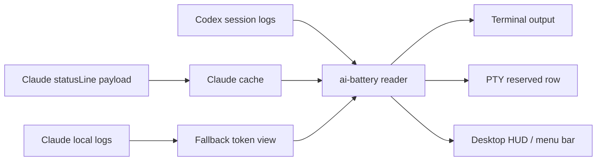

# AI Battery

[한국어](../../../README.md) · [English](../en/) · [日本語](../ja/) · [中文](../zh/) · [Español](../es/)

Medidor de batería de uso para Codex y Claude

Una herramienta de estado para terminal que muestra el uso restante de Codex y Claude Code como si fuera una batería.


[Instalación](#install) · [Funciones](#features) · [Inicio rápido](#quick-start) · [Claude StatusLine](#claude-statusline) · [HUD de escritorio](#desktop-hud) · [Precauciones](#caution)

<a id="overview"></a>
## Descripción general

`ai-battery` es una pequeña herramienta de estado para comprobar continuamente el uso restante y las horas de reinicio mientras usas Codex y Claude Code.

Para Codex, lee eventos `rate_limits` desde los registros de sesiones locales. Para Claude Code, almacena en caché el payload de rate-limit que entrega el hook `statusLine`. Si Claude registra un 429 rate-limit hit real, ese límite se refleja como 0% hasta su reset correspondiente. La salida predeterminada se mantiene compacta en una sola línea: las herramientas en ejecución se muestran en blanco, las inactivas en gris, y solo la barra de batería cambia de color según el uso restante: verde, naranja o rojo.


El fallback de texto en Markdown omite la barra para evitar diferencias de altura en caracteres de bloque según el renderizador. En una terminal real, los colores ANSI y las barras de bloque se renderizan juntos.

```text
Codex 86% │ 5h 18:09 │ 7d 82%  ┃  Claude 4% │ 5h 18:10 │ 7d 71%
```

| Proveedor | Fuente | Muestra |
| --- | --- | --- |
| Codex | `~/.codex/sessions/**/*.jsonl` | Restante 5h, hora de reset 5h, restante 7d |
| Claude Code | Claude `statusLine` payload cache + 429 hit logs | Restante 5h, hora de reset 5h, restante 7d |
| Claude fallback | `~/.claude/projects/**/*.jsonl` | Uso de tokens del turno reciente |

<a id="features"></a>
## Funciones

| Función | Descripción |
| --- | --- |
| Visualización común de uso | Muestra el uso de Codex y Claude Code con el mismo formato. |
| Hora de reset | Muestra las etiquetas y valores de las ventanas `5h` y `7d`. |
| Criterios de color | Resalta solo la batería: verde sobre 40%, naranja entre 21-40% y rojo en 20% o menos. |
| Codex terminal row | Proporciona un PTY wrapper que fija una fila de uso dedicada debajo de Codex. |
| Claude statusLine | Lee el estado de rate limit de Claude desde el hook statusLine integrado de Claude Code y los registros reales de 429 hit. |
| HUD / menu bar | Proporciona un HUD flotante en Windows nativo/WSL y un elemento de barra de menús en macOS. |
| Ejecución con npm | Puede ejecutarse con `npm install -g` o `npx`. |

<a id="platform-support"></a>
## Compatibilidad de plataformas

| Modo | Windows nativo | WSL | Linux | macOS | Nota |
| --- | --- | --- | --- | --- | --- |
| `ai-battery` | Compatible | Compatible | Compatible | Compatible | Requiere Node.js 18 o posterior. |
| `ai-battery --watch` | Compatible | Compatible | Compatible | Compatible | Se actualiza periódicamente dentro de la terminal. |
| Claude statusLine | Compatible | Compatible | Compatible | Compatible | Guarda un comando `node <script>` en Claude Code `statusLine`. |
| Codex terminal row | Compatible | Compatible | Compatible | Compatible | En Windows, reserva una fila inferior si `rowpty.exe` (el host ConPTY dedicado) está disponible; si no, funciona como una overlay row dibujada en la misma consola. WSL/Linux/macOS usan POSIX PTY y `python3`. |
| `ai-battery setup codex` | Compatible | Compatible | Compatible | Compatible | Configura Codex `[tui].status_line` e instala un wrapper `codex.cmd` en Windows o un wrapper POSIX shell en WSL/Linux/macOS. |
| `ai-battery hud` | Compatible | Compatible | No compatible | Compatible | Windows/WSL usan un HUD PowerShell/WinForms; macOS usa un elemento de barra de menús. |

La detección de procesos en ejecución usa `/proc` en Linux/WSL, `ps` en macOS y listados de procesos de PowerShell en Windows. La salida de texto usa blanco/gris; el HUD de macOS resalta solo los elementos en ejecución con barras de batería de color y muestra los elementos inactivos en gris tenue.

<a id="install"></a>
## Instalación

```bash
npm install -g ai-battery
```

También puedes ejecutarlo directamente sin instalarlo.

```bash
npx ai-battery
```

Los nombres anteriores, `claudex-battery`, `claudex-battery-run` y `claudex-battery-hud`, siguen disponibles como alias de compatibilidad.

<a id="quick-start"></a>
## Inicio rápido

1. Instala el paquete.

   ```bash
   npm install -g ai-battery
   ```

2. Configura la visualización automática para Claude y Codex.

   ```bash
   ai-battery setup
   ```

3. Después, sigue usando los comandos originales como siempre.

   ```bash
   claude
   codex
   ```

4. Inicia el HUD de escritorio o la visualización de barra de menús de macOS cuando la necesites.

   ```bash
   ai-battery hud
   ```

<a id="cli"></a>
## CLI

```bash
ai-battery
ai-battery --watch 10
ai-battery --json
ai-battery --version
ai-battery --provider codex
ai-battery --provider claude
ai-battery setup
ai-battery uninstall
ai-battery doctor
ai-battery hud
ai-battery off codex
ai-battery on codex
```

| Opción | Descripción |
| --- | --- |
| `--provider all\|codex\|claude` | Elige qué provider mostrar. |
| `--watch [seconds]` | Se actualiza periódicamente en la misma línea. |
| `--json` | Produce JSON útil para HUDs u otras herramientas. |
| `--bar-width N` | Ajusta el ancho de la barra de batería en la terminal. |
| `--show-paths` | Muestra rutas de archivos de log y timestamps de observación de datos. |
| `-v`, `--version` | Imprime la versión instalada de `ai-battery`. |

`doctor` comprueba el estado de instalación y la versión latest de npm. Si la red está bloqueada, solo se omite la comprobación de versión y el resto del diagnóstico se sigue mostrando.

<a id="uninstall"></a>
## Desinstalación

`off` solo oculta la visualización. `uninstall` elimina los puntos de integración creados por `setup` y el autostart del HUD.

```bash
ai-battery uninstall
```

También puedes eliminar solo una parte.

```bash
ai-battery uninstall codex
ai-battery uninstall claude
ai-battery uninstall hud
```

Este comando limpia el Codex wrapper administrado por AI Battery, Codex `[tui].status_line`, Claude `statusLine`, el autostart del HUD/menu bar y cualquier HUD en ejecución. No toca un archivo `codex` creado por otra herramienta ni un Claude `statusLine` creado en otro lugar. Si el usuario modificó la configuración de Codex después de setup, se conserva tal como está. Si versiones anteriores o `--force` crearon copias de seguridad, el comando restaura el archivo o symlink original cuando es posible. La terminal row de una sesión de Codex que ya se esté ejecutando dentro del wrapper de AI Battery desaparece solo cuando esa sesión termina.

Las versiones modernas de npm no ejecutan el uninstall lifecycle del paquete, por lo que `npm uninstall ai-battery` o `npm uninstall -g ai-battery` por sí solos no pueden limpiar automáticamente los puntos de integración externos. Para eliminar todo, ejecuta esto antes de borrar el paquete npm.

```bash
ai-battery uninstall
npm uninstall -g ai-battery
```

Si ya eliminaste primero el paquete npm, vuelve a instalarlo y ejecuta `ai-battery uninstall`, o revisa y elimina manualmente estos elementos: el Codex wrapper creado por AI Battery, el bloque `# >>> ai-battery setup >>>` en los archivos shell rc, Codex `~/.codex/config.toml` `[tui].status_line`, Claude `statusLine` y el autostart del HUD/menu bar.

<a id="setup"></a>
## Configuración

Ejecuta `setup` una sola vez. Instala un hook statusLine para Claude Code y configura Codex con una status line predeterminada más un wrapper de plataforma, de modo que luego puedas seguir iniciando los comandos originales.

```bash
ai-battery setup
```

También puedes configurar solo una parte.

```bash
ai-battery setup claude
ai-battery setup codex
```

Codex setup configura las entradas de status line `model-with-reasoning`, `current-dir` y `git-branch` bajo `[tui]` en `~/.codex/config.toml`. Los valores existentes se respaldan para poder restaurarlos durante uninstall. El Codex wrapper no sobrescribe directamente el comando `codex` existente. Si `~/.local/bin` ya aparece en PATH antes del `codex` original y `~/.local/bin/codex` está vacío o administrado por AI Battery, el wrapper se coloca allí para que se use de inmediato. De lo contrario, se crea un wrapper administrado en `~/.local/share/ai-battery/bin/codex`, y ese directorio se antepone a PATH en la configuración del shell cuando hace falta. Si una ubicación compartida como `~/.local/bin/codex` ya contiene otro archivo, no se sobrescribe. Las nuevas terminales ejecutarán automáticamente `codex` con la fila inferior de AI Battery. Si ya ejecutaste `codex` en la misma terminal, puede que la caché del shell requiera un `hash -r`; si hace falta actualizar PATH, ejecuta el comando `source ...` que imprime `setup`.

En `cmd`/PowerShell nativo de Windows, el wrapper `codex.cmd` ejecuta el runner de Windows. El valor predeterminado actual es el **HUD acoplado a la terminal**: Codex se ejecuta directamente en la terminal sin una capa PTY intermedia, y el HUD de batería se acopla a la ventana de la terminal. La fila TUI basada en rowpty sigue disponible con `AI_BATTERY_WIN_LAYOUT=tui`, y el antiguo `AI_BATTERY_WIN_LAYOUT=auto` usa la misma ruta TUI. En esa ruta, cuando `rowpty.exe` está disponible, el runner reserva una fila inferior igual que en WSL; si no hay rowpty, usa un overlay en la misma consola. `plain` desactiva la visualización. `rowpty.exe` no se distribuye como binario. `ai-battery setup` compila el código fuente incluido en el paquete (`vendor/rowpty/RowPty.cs`) directamente en la máquina del usuario con el `csc.exe` integrado de .NET Framework de Windows, lo instala en `%LOCALAPPDATA%\ai-battery\bin` y coloca junto a él componentes ConPTY firmados por Microsoft (`conpty.dll`/`OpenConsole.exe`, copiados del paquete node-pty). La ruta TUI usa por defecto ese ConPTY incluido. El OS ConPTY integrado de Windows vuelve a renderizar la inserción de historial por scroll region de Codex como repintados completos del viewport, lo que produce fotogramas fantasma y texto de respuesta desordenado. rowpty responde por sí mismo a la consulta DA1 de arranque del ConPTY incluido, así que el antiguo retraso de 3 segundos también desapareció. Usa `AI_BATTERY_ROWPTY_CONPTY=os` para volver al OS ConPTY. Claude statusLine aparece solo dentro de Claude Code, no en un prompt normal de `cmd`/PowerShell.

En tmux, reservar una fila inferior en cada pane duplicaría la misma batería global tantas veces como panes haya. En su lugar, puedes mostrarla una sola vez por sesión en la status bar de tmux.

```bash
ai-battery setup tmux
```

Esto agrega un bloque administrado a `~/.tmux.conf`, muestra la batería en `status-right` con actualización cada 10 segundos, y hace que `codex` dentro de tmux use todo el pane en lugar de añadir una fila de batería por pane. Claude statusLine también colapsa la fila de batería en el mismo entorno y muestra solo la fila de encabezado (modelo, directorio, rama), porque la batería ya está en la barra de tmux. Para aplicarlo, ejecuta `tmux source-file ~/.tmux.conf` y abre un nuevo pane. Este bloque sobrescribe la configuración existente de `status-right`, por lo que es opt-in y no se incluye en `setup all`. Se elimina con `ai-battery uninstall tmux`; si quieres mantener filas por pane dentro de tmux, configura `AI_BATTERY_TMUX=row`. Claude statusLine forma parte de la UI interna de Claude Code, así que se muestra independientemente de tmux.

Si la fila inferior de Codex no aparece, ejecuta el diagnóstico.

```bash
ai-battery doctor
```

El provider mostrado se cambia con comandos cortos on/off.

```bash
ai-battery off codex
ai-battery on codex
ai-battery off claude
ai-battery on claude
ai-battery off all
ai-battery on all
```

Esta configuración se aplica conjuntamente a la CLI, Claude statusLine, Codex wrapper y HUD.

<a id="codex-terminal-row"></a>
## Fila de terminal de Codex

`ai-battery setup` configura la status line propia de Codex como `modelo/esfuerzo de razonamiento · workspace · git branch`. La visualización de uso la gestiona un wrapper `codex` separado, así que el usuario solo escribe `codex` como siempre y `ai-battery-run` ejecuta internamente Codex dentro de un PTY una línea más corto.

```bash
codex
```

Los usuarios avanzados que necesiten ejecutar el wrapper directamente pueden usar este comando.

```bash
ai-battery-run --provider all codex
```

Usa `--interval` para reducir el intervalo de actualización.

```bash
ai-battery-run --interval 1 --provider all codex
```

<a id="claude-statusline"></a>
## Claude StatusLine

Claude Code proporciona el uso de rate-limit y las horas de reset mediante el hook integrado `statusLine`. AI Battery combina eso con registros reales de 429 rate-limit hit en los JSONL de Claude. Después de la instalación, Claude renderiza dos líneas.


```text
Opus high · ~/Projects · main                               83% context left
Codex 71% │ 5h 00:47 │ 7d 90%  Claude 76% │ 5h 00:47 │ 7d 59%
```

La primera línea muestra el modelo, nivel de razonamiento, workspace root y git branch, con el contexto restante de Claude fijado al borde derecho. La segunda línea muestra el uso de Codex y Claude con el mismo formato.

Configuración:

```bash
ai-battery setup claude
```

Eliminar:

```bash
ai-battery uninstall-claude-statusline
```

Claude debe entregar al menos una vez un payload de statusLine para que se cree la caché de uso de Claude. Hasta entonces se muestra el fallback basado en registros locales de Claude.

<a id="desktop-hud"></a>
## HUD de escritorio

Dibujar de forma segura una status line sobre una terminal normal desde un proceso externo no es estable. Por eso AI Battery proporciona un overlay flotante en Windows y un elemento de barra de menús superior en macOS. En Windows nativo se ejecuta directamente con PowerShell/WinForms sin WSL; desde WSL, inicia el mismo HUD mediante `powershell.exe`. En macOS muestra logos de Codex y Claude, medidores compactos y porcentajes como una pequeña imagen SVG con fondo transparente. Al hacer clic se puede ver el estado detallado.

```bash
ai-battery hud
```

El HUD se ejecuta en segundo plano y devuelve inmediatamente el control a la terminal. El HUD de Windows puede moverse arrastrándolo y reutiliza la posición guardada en el siguiente inicio. El elemento de barra de menús de macOS aparece en el área derecha de la barra de menús del sistema.

```text
Codex  [battery:88] │ 5h 00:47 │ 7d 93%
Claude [battery:76] │ 5h 00:47 │ 7d 59%
```

| Comando | Rol |
| --- | --- |
| `ai-battery hud` / `ai-battery hud start` | Inicia el HUD flotante de Windows o el elemento de barra de menús de macOS. |
| `ai-battery hud stop` | Detiene el HUD/menu bar item en ejecución. (`--stop` es equivalente.) |
| `ai-battery hud status` | Muestra si el HUD/menu bar item está en ejecución y si autostart está registrado. |
| `ai-battery hud autostart on` | Registra el inicio automático al iniciar sesión en Windows o macOS. |
| `ai-battery hud autostart off` | Elimina el registro de inicio automático. |
| `ai-battery hud autostart status` | Muestra solo el estado de registro de autostart. |
| `ai-battery hud -Foreground` | Ejecuta adjunto a la terminal para depuración. |
| `ai-battery hud -Once` | Imprime una sola vez en la consola. |
| `ai-battery hud -Interval 2` | Cambia el intervalo de actualización. |
| `ai-battery hud -Mode tray` | Ejecuta en modo Windows tray icon. En macOS, el elemento de barra de menús es el predeterminado. |
| `ai-battery hud light` / `ai-battery hud dark` | Cambia el HUD flotante de Windows a texto negro para una barra de tareas clara o texto blanco para una barra de tareas oscura. |
| `ai-battery hud black` / `ai-battery hud white` | Cambia directamente el color del texto a negro o blanco. |
| `ai-battery hud --backdrop` / `ai-battery hud --no-backdrop` | Activa o desactiva el fondo oscuro detrás del texto del HUD flotante de Windows. |

El HUD flotante de Windows usa por defecto texto claro sobre fondo transparente. En una barra de tareas clara usa `ai-battery hud light`; en una oscura usa `ai-battery hud dark`. Para elegir el color de texto directamente, usa `ai-battery hud black` o `ai-battery hud white`. Para guardar el mismo modo en el inicio automático, añade el modo como en `ai-battery hud autostart on light`.

El autostart de Windows se registra por usuario en `HKCU\Software\Microsoft\Windows\CurrentVersion\Run`. En Windows nativo se ejecuta directamente sin WSL; si se registra desde WSL, se coloca una copia del script HUD en `%LOCALAPPDATA%\ai-battery`. El autostart de macOS se registra como `~/Library/LaunchAgents/com.ai-battery.hud.plist`. Después de actualizar ai-battery, ejecuta de nuevo `ai-battery hud autostart on` para refrescar la ruta registrada.

<a id="shell-prompt"></a>
## Prompt de shell

También puedes añadirlo al prompt de shell.

```bash
export PS1='$(ai-battery --provider codex) '"$PS1"
```

El método de prompt se actualiza cada vez que se ejecuta un comando. Usa `ai-battery setup` o `ai-battery hud` si necesitas una visualización persistente.

<a id="how-it-works"></a>
## Cómo funciona



Codex busca eventos `rate_limits` en los registros de sesiones recientes. Claude Code proporciona uso y horas de reset mediante el payload statusLine, y los registros reales de 429 rate-limit hit se reflejan como 0% hasta el reset. En modo fallback, solo se puede consultar el uso reciente de tokens.

<a id="tech-stack"></a>
## Stack técnico

| Capa | Tecnología | Rol |
| --- | --- | --- |
| CLI | Node.js | Parseo de logs, Claude cache, salida ANSI/statusLine |
| PTY row | Python 3 | Reserved terminal row para ejecutar Codex |
| HUD launcher | Node.js / Bash compatibility wrapper | Lanza el HUD PowerShell de Windows nativo/WSL y la barra de menús de macOS |
| HUD UI | PowerShell WinForms / AppleScriptObjC | Overlay flotante de Windows, tray icon, elemento de barra de menús de macOS |
| Data | JSONL logs, statusLine JSON | Fuentes de uso de Codex/Claude |

<a id="source-environment"></a>
## Entorno de origen

La CLI predeterminada se ejecuta en Windows nativo, WSL, Linux y macOS cuando Node.js 18 o posterior está disponible. En Windows nativo, la Codex terminal row usa una reserved row cuando `rowpty.exe` está disponible (un host ConPTY dedicado construido con el csc.exe integrado de .NET Framework 4.8); si no, funciona como same-console overlay row del Node runner. En WSL/Linux/macOS, `ai-battery-run` usa Python 3 y POSIX PTY. El HUD usa PowerShell/WinForms en Windows/WSL y `osascript` integrado con AppleScriptObjC en macOS.

Los datos se leen del directorio `sessions` del `CODEX_HOME` que usa realmente Codex (`~/.codex` por defecto). AI Battery nunca configura ni cambia `HOME`, `USERPROFILE` o `CODEX_HOME`. Cambiar `CODEX_HOME` también cambia el almacén `/resume` de Codex, por lo que no debe usarse para combinar rutas de Windows y WSL. No se admiten varios homes separados por comas.

```bash
CODEX_HOME=/path/to/codex-home ai-battery --provider codex
```

Al usar Windows nativo y WSL juntos, cada entorno conserva sus propias sesiones y su historial `/resume`. Solo se comparte el uso global 5h/7d de la cuenta mediante el archivo `codex-account-usage.json` de AI Battery; no se comparten rutas de sesión, workspaces ni modos de aprobación/sandbox.

La visualización de uso de Claude está disponible después de instalar el hook statusLine de Claude Code.

<a id="caution"></a>
## Precauciones

- Esta herramienta lee registros locales y payloads de Claude statusLine. No reemplaza la pantalla oficial de facturación o límites del servicio.
- Si los eventos de Codex rate limit aún no se han generado o están desactualizados, la visualización puede diferir del estado más reciente.
- Claude statusLine solo proporciona uso y hora de reset, por lo que el estado real de hit se combina con los registros 429 rate-limit dejados por Claude.
- El HUD se basa en PowerShell/WinForms en Windows y en un elemento de barra de menús en macOS. En WSL usa `powershell.exe` y `wsl.exe` juntos.
- `ai-battery-run` es un PTY wrapper. Algunas TUI de pantalla completa pueden mover brevemente la status row debido a escape sequences que limpian la pantalla.
