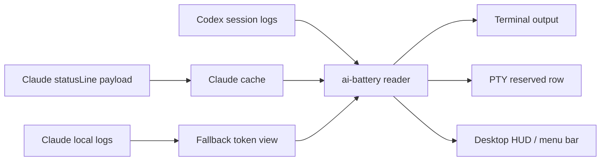

# AI Battery

[한국어](../../../README.md) · [English](../en/) · [日本語](../ja/) · [中文](../zh/) · [Español](../es/)

Codex と Claude の使用量バッテリーメーター

Codex と Claude Code の残り使用量を、バッテリーのように確認できるターミナル用ステータス表示ツールです。


[インストール](#install) · [機能](#features) · [クイックスタート](#quick-start) · [Claude StatusLine](#claude-statusline) · [Desktop HUD](#desktop-hud) · [注意](#caution)

<a id="overview"></a>
## 概要

`ai-battery` は、Codex と Claude Code を使いながら残り使用量とリセット時刻を継続的に確認するための小さなステータス表示ツールです。

Codex については、ローカルセッションログの `rate_limits` イベントを読み取ります。Claude Code については、`statusLine` hook が渡す rate-limit payload をキャッシュして使います。Claude が実際の 429 rate-limit hit を記録した場合は、該当する reset までその制限を 0% として反映します。デフォルト出力は小さな 1 行に保たれ、実行中のツールは白、実行中でないツールはグレーで表示されます。バッテリーバーだけが残量に応じて緑、オレンジ、赤に変わります。


Markdown のテキスト fallback では、レンダラーごとのブロック文字の高さの違いを避けるためにバーを省略しています。実際のターミナルでは ANSI カラーとブロックバーが一緒にレンダリングされます。

```text
Codex 86% │ 5h 18:09 │ 7d 82%  ┃  Claude 4% │ 5h 18:10 │ 7d 71%
```

| プロバイダー | ソース | 表示内容 |
| --- | --- | --- |
| Codex | `~/.codex/sessions/**/*.jsonl` | 5h 残量、5h リセット時刻、7d 残量 |
| Claude Code | Claude `statusLine` payload cache + 429 hit logs | 5h 残量、5h リセット時刻、7d 残量 |
| Claude fallback | `~/.claude/projects/**/*.jsonl` | 直近ターンのトークン使用量 |

<a id="features"></a>
## 機能

| 機能 | 説明 |
| --- | --- |
| 共通の使用量表示 | Codex と Claude Code の使用量を同じ形式で表示します。 |
| リセット時刻表示 | `5h`、`7d` のウィンドウラベルと値を表示します。 |
| 色の基準 | 40% 超は緑、21-40% はオレンジ、20% 以下は赤で、バッテリーだけを強調します。 |
| Codex terminal row | Codex の下に専用の使用量行を固定する PTY wrapper を提供します。 |
| Claude statusLine | Claude Code 内蔵の statusLine hook と実際の 429 hit ログから Claude の rate limit 状態を読み取ります。 |
| HUD / menu bar | Windows native/WSL では floating HUD、macOS では menu bar status item を提供します。 |
| npm 実行 | `npm install -g` または `npx` で実行できます。 |

<a id="platform-support"></a>
## プラットフォーム対応

| モード | Windows native | WSL | Linux | macOS | 備考 |
| --- | --- | --- | --- | --- | --- |
| `ai-battery` | 対応 | 対応 | 対応 | 対応 | Node.js 18 以上が必要です。 |
| `ai-battery --watch` | 対応 | 対応 | 対応 | 対応 | ターミナル内で定期的に更新します。 |
| Claude statusLine | 対応 | 対応 | 対応 | 対応 | Claude Code `statusLine` に `node <script>` コマンドを保存します。 |
| Codex terminal row | 対応 | 対応 | 対応 | 対応 | Windows では `rowpty.exe`（専用 ConPTY host）がある場合は下部行を予約し、ない場合は同じコンソールに重ねて描画する overlay row として動作します。WSL/Linux/macOS は POSIX PTY と `python3` を使います。 |
| `ai-battery setup codex` | 対応 | 対応 | 対応 | 対応 | Codex `[tui].status_line` を設定し、Windows では `codex.cmd` wrapper、WSL/Linux/macOS では POSIX shell wrapper をインストールします。 |
| `ai-battery hud` | 対応 | 対応 | 未対応 | 対応 | Windows/WSL は PowerShell/WinForms HUD、macOS は menu bar status item です。 |

実行中の検出には、Linux/WSL では `/proc`、macOS では `ps`、Windows では PowerShell のプロセス一覧を使います。テキスト出力は白/グレーで、macOS HUD では実行中の項目だけを色付きバッテリーバーで強調し、実行中でない項目は淡いグレー系で表示します。

<a id="install"></a>
## インストール

```bash
npm install -g ai-battery
```

インストールせずにすぐ実行することもできます。

```bash
npx ai-battery
```

以前の名前である `claudex-battery`、`claudex-battery-run`、`claudex-battery-hud` コマンドも、互換 alias として引き続き提供されます。

<a id="quick-start"></a>
## クイックスタート

1. パッケージをインストールします。

   ```bash
   npm install -g ai-battery
   ```

2. Claude と Codex の自動表示を設定します。

   ```bash
   ai-battery setup
   ```

3. 以降は元のコマンドをそのまま使います。

   ```bash
   claude
   codex
   ```

4. デスクトップ HUD または macOS menu bar 表示が必要な場合は起動します。

   ```bash
   ai-battery hud
   ```

<a id="cli"></a>
## CLI

```bash
ai-battery
ai-battery --watch 10
ai-battery --json
ai-battery --version
ai-battery --provider codex
ai-battery --provider claude
ai-battery setup
ai-battery uninstall
ai-battery doctor
ai-battery hud
ai-battery off codex
ai-battery on codex
```

| オプション | 説明 |
| --- | --- |
| `--provider all\|codex\|claude` | 表示する provider を選択します。 |
| `--watch [seconds]` | 同じ行で定期的に更新します。 |
| `--json` | HUD や他のツールで使いやすい JSON を出力します。 |
| `--bar-width N` | ターミナルのバッテリーバーの長さを調整します。 |
| `--show-paths` | ログファイルパスとデータ観測時刻を一緒に表示します。 |
| `-v`, `--version` | インストール済みの `ai-battery` バージョンを出力します。 |

`doctor` はインストール状態と npm latest バージョンを確認します。ネットワークが使えない場合はバージョン確認だけをスキップし、その他の診断は続けて表示します。

<a id="uninstall"></a>
## アンインストール

`off` は表示だけを隠す設定で、`uninstall` は `setup` と HUD autostart が作成した統合ポイントを削除します。

```bash
ai-battery uninstall
```

一部だけを削除することもできます。

```bash
ai-battery uninstall codex
ai-battery uninstall claude
ai-battery uninstall hud
```

このコマンドは、AI Battery が管理マーカーを入れた Codex wrapper、Codex `[tui].status_line`、Claude `statusLine`、HUD/menu bar autostart、実行中の HUD を整理します。他のツールが作成した `codex` ファイルや Claude `statusLine` には触れません。Codex config が setup 後にユーザーによって変更されている場合は、安全のためそのまま残します。旧バージョンや `--force` で既存ファイルをバックアップしていた場合は、可能な限り元のファイルまたは symlink を復元します。すでに AI Battery wrapper 内で実行中の Codex セッションの terminal row は、そのセッションを終了するまで消えません。

最近の npm はパッケージの uninstall lifecycle を実行しないため、`npm uninstall ai-battery` または `npm uninstall -g ai-battery` だけでは外部統合ポイントを自動で整理できません。完全に削除するには、npm パッケージを削除する前に次を実行してください。

```bash
ai-battery uninstall
npm uninstall -g ai-battery
```

すでに npm パッケージを先に削除してしまった場合は、もう一度インストールしてから `ai-battery uninstall` を実行するか、次の項目を手動で確認して削除してください: AI Battery が作成した Codex wrapper、shell rc の `# >>> ai-battery setup >>>` block、Codex `~/.codex/config.toml` の `[tui].status_line`、Claude `statusLine`、HUD/menu bar autostart。

<a id="setup"></a>
## セットアップ

`setup` は一度だけ実行します。Claude Code には statusLine hook をインストールし、Codex には基本 status line 設定と platform wrapper をインストールするため、その後は追加コマンドなしで元のように起動できます。

```bash
ai-battery setup
```

一部だけを設定することもできます。

```bash
ai-battery setup claude
ai-battery setup codex
```

Codex setup は `~/.codex/config.toml` の `[tui]` に `model-with-reasoning`、`current-dir`、`git-branch` status line を設定します。既存値がある場合は uninstall 復旧用にバックアップします。Codex wrapper は既存の `codex` コマンドを直接上書きしません。`~/.local/bin` がすでに PATH で元の `codex` より前にあり、`~/.local/bin/codex` が空か AI Battery 管理ファイルであれば、すぐに使われるようその場所に wrapper を置きます。そうでない場合は `~/.local/share/ai-battery/bin/codex` に管理 wrapper を作成し、必要に応じて shell 設定でこのディレクトリを PATH の前方に追加します。`~/.local/bin/codex` のような共有場所に別のファイルがすでにある場合は上書きしません。新しいターミナルからは `codex` が自動で AI Battery の下部行付きで実行されます。同じターミナルで既に `codex` を実行したことがある場合は shell cache のために一度 `hash -r` が必要になることがあり、PATH 追加が必要な場合は `setup` 出力に表示される `source ...` コマンドを実行してください。

Windows native の `cmd`/PowerShell では、`codex.cmd` wrapper が Windows runner を実行します。runner は `rowpty.exe`（別 rowpty プロジェクトの専用 ConPTY host）がある場合、WSL と同じ方式で下部行を予約します。子プログラムは 1 行短い画面を使い、ステータス行は出力が落ち着いたタイミングでだけ描画されるため、ちらつきなく下部に固定されます。`rowpty.exe` はバイナリ配布されません。`ai-battery setup` がパッケージ同梱のソース（`vendor/rowpty/RowPty.cs`）を Windows 内蔵 .NET Framework の `csc.exe` でユーザーマシン上で直接コンパイルし、`%LOCALAPPDATA%\ai-battery\bin` にインストールします。その隣に Microsoft 署名済みの ConPTY（`conpty.dll`/`OpenConsole.exe`、node-pty パッケージからコピー）も配置します。Codex の起動遅延を避けるため、実行時のデフォルトは Windows 内蔵 OS ConPTY です。バンドル provider が必要な場合は `AI_BATTERY_ROWPTY_CONPTY=bundled` で戻せます。未署名のダウンロード済みバイナリがないため、SmartScreen/Defender 系の評判警告を根本から避けられ、ソースはテキストとして監査できます。自分でビルドした exe を使う場合は `AI_BATTERY_ROWPTY` 環境変数で指定します。rowpty がない場合は同じコンソールに重ね描きする overlay layout として動作します（`AI_BATTERY_WIN_LAYOUT=overlay` で強制可能）。legacy `node-pty` reserve は、`AI_BATTERY_WIN_LAYOUT=reserve` で rowpty がない場合にのみ使われます。Claude statusLine は通常の `cmd`/PowerShell プロンプトではなく、Claude Code 内でのみ表示されます。

tmux では pane ごとに下部行を予約すると、同じグローバルバッテリーが pane の数だけ重複表示されます。代わりに tmux の status bar にセッションごと 1 回だけ表示できます。

```bash
ai-battery setup tmux
```

`~/.tmux.conf` に管理ブロックを追加し、status-right にバッテリーを表示します（10 秒間隔で更新）。この tmux 内で実行される `codex` は pane ごとのバッテリー行を省略し、pane 全体を使います。Claude statusLine も同じ環境ではバッテリー行を折りたたみ、ヘッダー（モデル、ディレクトリ、ブランチ）1 行だけを表示します。バッテリーはすでに tmux bar にあるためです。適用するには `tmux source-file ~/.tmux.conf` を実行し、新しい pane を開いてください。このブロックは既存の `status-right` 設定を上書きするため、`setup all` には含まれない opt-in です。解除は `ai-battery uninstall tmux`、tmux 内でも pane ごとの行を維持したい場合は `AI_BATTERY_TMUX=row` を設定します。Claude statusLine は Claude Code 内部 UI なので、tmux かどうかに関係なく表示されます。

Codex の下部行が表示されない場合は診断を実行します。

```bash
ai-battery doctor
```

表示する provider は短い on/off コマンドで変更します。

```bash
ai-battery off codex
ai-battery on codex
ai-battery off claude
ai-battery on claude
ai-battery off all
ai-battery on all
```

この設定は CLI、Claude statusLine、Codex wrapper、HUD にまとめて適用されます。

<a id="codex-terminal-row"></a>
## Codex ターミナル行

`ai-battery setup` は Codex 自体の status line を `モデル/推論強度 · ワークスペース · git branch` 構成に設定します。使用量表示は別の `codex` wrapper が担当するため、ユーザーは通常どおり `codex` と入力するだけで、`ai-battery-run` が内部で Codex を 1 行短い PTY の中で実行します。

```bash
codex
```

直接 wrapper を実行する必要がある上級ユーザーは、次のコマンドを使えます。

```bash
ai-battery-run --provider all codex
```

更新間隔を短くするには `--interval` を使います。

```bash
ai-battery-run --interval 1 --provider all codex
```

<a id="claude-statusline"></a>
## Claude StatusLine

Claude Code は内蔵の `statusLine` hook を通じて rate-limit 使用率と reset 時刻を提供します。AI Battery はそこに Claude JSONL の実際の 429 rate-limit hit 記録を合わせて反映します。インストール後、Claude は 2 行をレンダリングします。


```text
Opus high · ~/Projects · main                               83% context left
Codex 71% │ 5h 00:47 │ 7d 90%  Claude 76% │ 5h 00:47 │ 7d 59%
```

1 行目はモデル、推論レベル、workspace root、git branch を表示し、右端に Claude context 残量を固定します。2 行目は Codex と Claude の使用量を同じ形式で表示します。

設定:

```bash
ai-battery setup claude
```

削除:

```bash
ai-battery uninstall-claude-statusline
```

Claude が少なくとも一度 statusLine payload を渡すまで、Claude の使用量キャッシュは作成されません。それまでは Claude ローカルログベースの fallback が表示されます。

<a id="desktop-hud"></a>
## Desktop HUD

通常のターミナルの上に外部プロセスが安全に status line を描画する方法は安定していません。そのため Windows では floating overlay、macOS では上部 menu bar status item を提供します。Windows native では WSL なしで PowerShell/WinForms により直接実行され、WSL では `powershell.exe` を通じて同じ HUD を起動します。macOS では透明背景の小さな SVG 画像で Codex と Claude のロゴ、短いメーター、パーセントを表示し、クリックすると詳細な状態を確認できます。

```bash
ai-battery hud
```

HUD はバックグラウンドで実行され、ターミナルをすぐに返します。Windows HUD はドラッグで位置を移動でき、次回起動時に保存済み位置を再利用します。macOS menu bar item はシステムメニューバーの右側領域に表示されます。

```text
Codex  [battery:88] │ 5h 00:47 │ 7d 93%
Claude [battery:76] │ 5h 00:47 │ 7d 59%
```

| コマンド | 役割 |
| --- | --- |
| `ai-battery hud` / `ai-battery hud start` | Windows floating HUD または macOS menu bar item を開始します。 |
| `ai-battery hud stop` | 実行中の HUD/menu bar item を終了します。(`--stop` も同じです。) |
| `ai-battery hud status` | HUD/menu bar の実行状態と autostart 登録状態を表示します。 |
| `ai-battery hud autostart on` | Windows ログインまたは macOS ログイン時の自動実行を登録します。 |
| `ai-battery hud autostart off` | 自動実行登録を解除します。 |
| `ai-battery hud autostart status` | 自動実行登録状態だけを表示します。 |
| `ai-battery hud -Foreground` | デバッグ用にターミナルに接続して実行します。 |
| `ai-battery hud -Once` | コンソールに一度だけ出力します。 |
| `ai-battery hud -Interval 2` | 更新間隔を変更します。 |
| `ai-battery hud -Mode tray` | Windows tray icon モードで実行します。macOS では menu bar item がデフォルトです。 |
| `ai-battery hud light` / `ai-battery hud dark` | Windows floating HUD を、明るいタスクバー用の黒文字または暗いタスクバー用の白文字に切り替えます。 |
| `ai-battery hud black` / `ai-battery hud white` | 文字色を直接黒または白に変更します。 |
| `ai-battery hud --backdrop` / `ai-battery hud --no-backdrop` | Windows floating HUD の文字背後にある暗い backing をオン/オフします。 |

Windows floating HUD はデフォルトで透明背景に明るい文字で表示します。明るいタスクバーでは `ai-battery hud light`、暗いタスクバーでは `ai-battery hud dark` を使ってください。文字色を直接選ぶ場合は `ai-battery hud black` または `ai-battery hud white` を使います。ログイン自動実行にも同じモードを保存するには、`ai-battery hud autostart on light` のように指定します。

Windows autostart は `HKCU\Software\Microsoft\Windows\CurrentVersion\Run` にユーザー単位で登録されます。Windows native では WSL なしで直接実行され、WSL から登録した場合は HUD スクリプトのコピーを `%LOCALAPPDATA%\ai-battery` に置きます。macOS autostart は `~/Library/LaunchAgents/com.ai-battery.hud.plist` として登録されます。ai-battery を更新した後は、`ai-battery hud autostart on` を再実行して登録パスを更新してください。

<a id="shell-prompt"></a>
## シェルプロンプト

シェルプロンプトに入れることもできます。

```bash
export PS1='$(ai-battery --provider codex) '"$PS1"
```

プロンプト方式はコマンドを実行するたびに更新されます。常に表示したい場合は `ai-battery setup` または `ai-battery hud` を使ってください。

<a id="how-it-works"></a>
## 仕組み



Codex は直近のセッションログから `rate_limits` イベントを探します。Claude Code は statusLine payload で使用率とリセット時刻を提供し、実際の 429 rate-limit hit ログがある場合は reset まで 0% として反映します。fallback モードでは直近のトークン使用量だけを確認できます。

<a id="tech-stack"></a>
## 技術スタック

| レイヤー | 技術 | 役割 |
| --- | --- | --- |
| CLI | Node.js | ログ解析、Claude cache、ANSI/statusLine 出力 |
| PTY row | Python 3 | Codex 実行用の reserved terminal row |
| HUD launcher | Node.js / Bash compatibility wrapper | Windows native/WSL PowerShell HUD と macOS menu bar の起動 |
| HUD UI | PowerShell WinForms / AppleScriptObjC | Windows floating overlay、tray icon、macOS menu bar item |
| Data | JSONL logs, statusLine JSON | Codex/Claude 使用量ソース |

<a id="source-environment"></a>
## ソース環境

基本 CLI は Node.js 18 以上があれば Windows native、WSL、Linux、macOS で実行できます。Windows native の Codex terminal row は `rowpty.exe`（専用 ConPTY host、.NET Framework 4.8 内蔵 csc.exe でビルド）がある場合は reserved row を使い、ない場合は Node runner の same-console overlay row として動作します。WSL/Linux/macOS の `ai-battery-run` は Python 3 と POSIX PTY を使います。HUD は Windows/WSL では PowerShell/WinForms、macOS では内蔵 `osascript` と AppleScriptObjC を使います。

Codex データはデフォルトで `~/.codex/sessions` を読みます。別の場所を使っている場合は `CODEX_HOME` を設定してください。

```bash
CODEX_HOME=/path/to/codex-home ai-battery --provider codex
```

Claude の使用量表示は、Claude Code statusLine hook をインストールした後から利用できます。

<a id="caution"></a>
## 注意

- このツールはローカルログと Claude statusLine payload を読み取ります。サービスの公式課金/制限画面の代わりにはなりません。
- Codex rate limit イベントがまだ生成されていない、または古い場合、最新状態と差が出ることがあります。
- Claude statusLine は使用率と reset 時刻だけを提供するため、実際の hit 状態は Claude が残した 429 rate-limit ログと合わせて反映します。
- HUD は Windows では PowerShell/WinForms ベース、macOS では menu bar status item ベースです。WSL では `powershell.exe` と `wsl.exe` を一緒に使います。
- `ai-battery-run` は PTY wrapper です。一部の全画面 TUI では画面を消去する escape sequence のため、status row が一時的に揺れることがあります。
