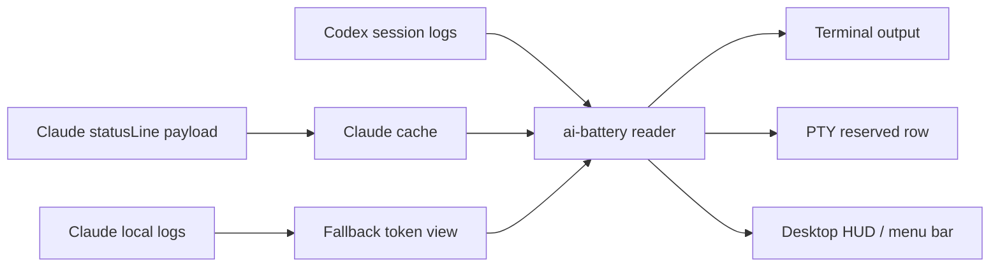

# AI Battery

[한국어](../../../README.md) · [English](../en/) · [日本語](../ja/) · [中文](../zh/) · [Español](../es/)

Codex 和 Claude 使用量电量计

一个终端状态显示工具，可以像电池一样查看 Codex 和 Claude Code 的剩余使用量。


[安装](#install) · [功能](#features) · [快速开始](#quick-start) · [Claude StatusLine](#claude-statusline) · [桌面 HUD](#desktop-hud) · [注意事项](#caution)

<a id="overview"></a>
## 概览

`ai-battery` 是一个小型状态显示工具，用于在使用 Codex 和 Claude Code 时持续查看剩余使用量和重置时间。

Codex 会读取本地会话日志中的 `rate_limits` 事件；Claude Code 会缓存 `statusLine` hook 传入的 rate-limit payload。如果 Claude 记录了真实的 429 rate-limit hit，则在对应 reset 之前将该限制显示为 0%。默认输出保持为紧凑的一行：正在运行的工具显示为白色，未运行的工具显示为灰色，只有电量条会根据余量变为绿色、橙色或红色。


Markdown 的文本 fallback 会省略电量条，以避免不同渲染器中块字符高度差异带来的问题。在真实终端中，ANSI 颜色和块状电量条会一起渲染。

```text
Codex 86% │ 5h 18:09 │ 7d 82%  ┃  Claude 4% │ 5h 18:10 │ 7d 71%
```

| Provider | 来源 | 显示内容 |
| --- | --- | --- |
| Codex | `~/.codex/sessions/**/*.jsonl` | 5h 余量、5h 重置时间、7d 余量 |
| Claude Code | Claude `statusLine` payload cache + 429 hit logs | 5h 余量、5h 重置时间、7d 余量 |
| Claude fallback | `~/.claude/projects/**/*.jsonl` | 最近一轮 token 使用量 |

<a id="features"></a>
## 功能

| 功能 | 说明 |
| --- | --- |
| 统一使用量显示 | 以相同格式显示 Codex 和 Claude Code 的使用量。 |
| 重置时间显示 | 显示 `5h`、`7d` 窗口标签和值。 |
| 颜色规则 | 仅突出电量条：40% 以上为绿色，21-40% 为橙色，20% 以下为红色。 |
| Codex terminal row | 提供 PTY wrapper，在 Codex 下方固定一行专用使用量显示。 |
| Claude statusLine | 通过 Claude Code 内置 statusLine hook 和真实 429 hit 日志读取 Claude rate limit 状态。 |
| HUD / menu bar | Windows 原生/WSL 提供 floating HUD，macOS 提供 menu bar status item。 |
| npm 运行 | 可以通过 `npm install -g` 或 `npx` 运行。 |

<a id="platform-support"></a>
## 平台支持

| 模式 | Windows native | WSL | Linux | macOS | 备注 |
| --- | --- | --- | --- | --- | --- |
| `ai-battery` | 支持 | 支持 | 支持 | 支持 | 需要 Node.js 18 或更高版本。 |
| `ai-battery --watch` | 支持 | 支持 | 支持 | 支持 | 在终端内周期性刷新。 |
| Claude statusLine | 支持 | 支持 | 支持 | 支持 | 将 `node <script>` 命令保存到 Claude Code `statusLine`。 |
| Codex terminal row | 支持 | 支持 | 支持 | 支持 | Windows 上如果存在 `rowpty.exe`（专用 ConPTY host），会预留下方一行；否则会在同一控制台中绘制 overlay row。WSL/Linux/macOS 使用 POSIX PTY 和 `python3`。 |
| `ai-battery setup codex` | 支持 | 支持 | 支持 | 支持 | 配置 Codex `[tui].status_line`，并在 Windows 上安装 `codex.cmd` wrapper，在 WSL/Linux/macOS 上安装 POSIX shell wrapper。 |
| `ai-battery hud` | 支持 | 支持 | 不支持 | 支持 | Windows/WSL 使用 PowerShell/WinForms HUD，macOS 使用 menu bar status item。 |

运行中检测在 Linux/WSL 上使用 `/proc`，在 macOS 上使用 `ps`，在 Windows 上使用 PowerShell 进程列表。文本输出使用白色/灰色；macOS HUD 只用彩色电量条突出正在运行的项目，未运行项目则使用淡灰色显示。

<a id="install"></a>
## 安装

```bash
npm install -g ai-battery
```

也可以不安装，直接运行。

```bash
npx ai-battery
```

旧名称 `claudex-battery`、`claudex-battery-run`、`claudex-battery-hud` 仍作为兼容 alias 一并提供。

<a id="quick-start"></a>
## 快速开始

1. 安装包。

   ```bash
   npm install -g ai-battery
   ```

2. 设置 Claude 和 Codex 自动显示。

   ```bash
   ai-battery setup
   ```

3. 之后继续照常使用原来的命令。

   ```bash
   claude
   codex
   ```

4. 如果需要桌面 HUD 或 macOS menu bar 显示，请启动它。

   ```bash
   ai-battery hud
   ```

<a id="cli"></a>
## CLI

```bash
ai-battery
ai-battery --watch 10
ai-battery --json
ai-battery --version
ai-battery --provider codex
ai-battery --provider claude
ai-battery setup
ai-battery uninstall
ai-battery doctor
ai-battery hud
ai-battery off codex
ai-battery on codex
```

| 选项 | 说明 |
| --- | --- |
| `--provider all\|codex\|claude` | 选择要显示的 provider。 |
| `--watch [seconds]` | 在同一行周期性刷新。 |
| `--json` | 输出便于 HUD 或其他工具使用的 JSON。 |
| `--bar-width N` | 调整终端电量条长度。 |
| `--show-paths` | 同时显示日志文件路径和数据观测时间。 |
| `-v`, `--version` | 输出已安装的 `ai-battery` 版本。 |

`doctor` 会检查安装状态以及 npm latest 版本。如果网络不可用，只会跳过版本检查，其余诊断仍会继续显示。

<a id="uninstall"></a>
## 卸载

`off` 只是隐藏显示，`uninstall` 会移除 `setup` 和 HUD autostart 创建的集成点。

```bash
ai-battery uninstall
```

也可以只移除其中一部分。

```bash
ai-battery uninstall codex
ai-battery uninstall claude
ai-battery uninstall hud
```

此命令会清理由 AI Battery 管理的 Codex wrapper、Codex `[tui].status_line`、Claude `statusLine`、HUD/menu bar autostart 以及正在运行的 HUD。它不会触碰其他工具创建的 `codex` 文件或 Claude `statusLine`。如果 Codex config 在 setup 后被用户修改过，会安全地保留原样。如果旧版本或 `--force` 备份过已有文件，会尽可能恢复原始文件或 symlink。当前已经在 AI Battery wrapper 中运行的 Codex 会话，其 terminal row 只有在该会话结束后才会消失。

新版 npm 不会执行包的 uninstall lifecycle，因此仅运行 `npm uninstall ai-battery` 或 `npm uninstall -g ai-battery` 无法自动清理外部集成点。要完全移除，请先运行：

```bash
ai-battery uninstall
npm uninstall -g ai-battery
```

如果已经先删除了 npm 包，请重新安装后运行 `ai-battery uninstall`，或手动检查并删除以下项目：AI Battery 创建的 Codex wrapper、shell rc 中的 `# >>> ai-battery setup >>>` block、Codex `~/.codex/config.toml` 中的 `[tui].status_line`、Claude `statusLine`、HUD/menu bar autostart。

<a id="setup"></a>
## 设置

`setup` 只需要运行一次。它会为 Claude Code 安装 statusLine hook，并为 Codex 安装默认 status line 配置和平台 wrapper，因此之后可以继续像原来一样运行命令。

```bash
ai-battery setup
```

也可以只设置其中一部分。

```bash
ai-battery setup claude
ai-battery setup codex
```

Codex setup 会在 `~/.codex/config.toml` 的 `[tui]` 中设置 `model-with-reasoning`、`current-dir`、`git-branch` status line。已有值会备份，以便 uninstall 时恢复。Codex wrapper 不会直接覆盖现有的 `codex` 命令。如果 `~/.local/bin` 已经在 PATH 中位于原始 `codex` 之前，并且 `~/.local/bin/codex` 为空或由 AI Battery 管理，则 wrapper 会放在该位置以便立即生效。否则会在 `~/.local/share/ai-battery/bin/codex` 创建受管理的 wrapper，并在需要时将该目录添加到 shell 配置中 PATH 的前部。如果 `~/.local/bin/codex` 这类公共位置已经存在其他文件，则不会覆盖。新的终端会自动以 AI Battery 下方状态行运行 `codex`。如果同一终端中已经运行过 `codex`，shell 缓存可能需要执行一次 `hash -r`；如果需要追加 PATH，请执行 `setup` 输出中显示的 `source ...` 命令。

在 Windows 原生 `cmd`/PowerShell 中，`codex.cmd` wrapper 会运行 Windows runner。runner 在存在 `rowpty.exe`（独立 rowpty 项目的专用 ConPTY host）时，会以和 WSL 相同的方式预留下方一行：子程序使用少一行的屏幕，状态行只在输出安静时绘制，因此可以无闪烁地固定在底部。`rowpty.exe` 不以二进制形式分发。`ai-battery setup` 会在用户机器上使用 Windows 内置 .NET Framework `csc.exe` 直接编译包内源码（`vendor/rowpty/RowPty.cs`），安装到 `%LOCALAPPDATA%\ai-battery\bin`，并在旁边放置 Microsoft 签名的 ConPTY（`conpty.dll`/`OpenConsole.exe`，从 node-pty 包复制）。为了避免拖慢 Codex 启动，运行时默认使用 Windows 内置 OS ConPTY；如果需要 bundled provider，可设置 `AI_BATTERY_ROWPTY_CONPTY=bundled` 切回。rowpty 默认会阻止 alternate-screen 切换和清空 scrollback 的序列，以保留 Windows Terminal 的 scrollback；如需关闭，可设置 `AI_BATTERY_ROWPTY_PRESERVE_SCROLLBACK=0`。由于没有未签名的下载二进制文件，可以从根源避免 SmartScreen/Defender 类声誉警告，并且源码以文本形式可供审计。要使用自己构建的 exe，请通过 `AI_BATTERY_ROWPTY` 环境变量指定。没有 rowpty 时，会退回到在同一控制台中绘制的 overlay layout（可用 `AI_BATTERY_WIN_LAYOUT=overlay` 强制）；legacy `node-pty` reserve 只有在 `AI_BATTERY_WIN_LAYOUT=reserve` 且没有 rowpty 时才会使用。Claude statusLine 只会显示在 Claude Code 内部，而不是普通 `cmd`/PowerShell 提示符中。

在 tmux 中，如果每个 pane 都预留下方一行，同一个全局电量状态会按 pane 数量重复显示。可以改为在 tmux status bar 中每个 session 只显示一次。

```bash
ai-battery setup tmux
```

这会向 `~/.tmux.conf` 添加受管理 block，在 status-right 中显示电量状态（每 10 秒刷新一次）；在该 tmux 内运行的 `codex` 会省略每个 pane 的电量行，使用完整 pane。Claude statusLine 在同一环境中也会折叠电量行，只显示 header（模型、目录、分支）一行，因为电量已经显示在 tmux bar 中。要应用配置，请运行 `tmux source-file ~/.tmux.conf` 后打开新的 pane。此 block 会覆盖现有 `status-right` 设置，因此它是 opt-in，不包含在 `setup all` 中。用 `ai-battery uninstall tmux` 可解除；如果希望在 tmux 内仍保留每个 pane 的状态行，请设置 `AI_BATTERY_TMUX=row`。Claude statusLine 属于 Claude Code 内部 UI，因此无论是否使用 tmux 都会显示。

如果看不到 Codex 下方状态行，请运行诊断。

```bash
ai-battery doctor
```

显示哪些 provider 可以用简短的 on/off 命令切换。

```bash
ai-battery off codex
ai-battery on codex
ai-battery off claude
ai-battery on claude
ai-battery off all
ai-battery on all
```

此设置会同时应用于 CLI、Claude statusLine、Codex wrapper 和 HUD。

<a id="codex-terminal-row"></a>
## Codex 终端行

`ai-battery setup` 会将 Codex 自身的 status line 配置为 `模型/推理强度 · 工作区 · git branch`。使用量显示由单独的 `codex` wrapper 负责，因此用户只需像平常一样输入 `codex`，`ai-battery-run` 就会在内部以少一行的 PTY 运行 Codex。

```bash
codex
```

需要直接运行 wrapper 的高级用户可以使用以下命令。

```bash
ai-battery-run --provider all codex
```

要缩短刷新周期，请使用 `--interval`。

```bash
ai-battery-run --interval 1 --provider all codex
```

<a id="claude-statusline"></a>
## Claude StatusLine

Claude Code 通过内置 `statusLine` hook 提供 rate-limit 使用率和 reset 时间。AI Battery 会将其与 Claude JSONL 中真实的 429 rate-limit hit 记录一起反映。安装后，Claude 会渲染两行。


```text
Opus high · ~/Projects · main                               83% context left
Codex 71% │ 5h 00:47 │ 7d 90%  Claude 76% │ 5h 00:47 │ 7d 59%
```

第一行显示模型、推理等级、workspace root、git branch，并在右端固定显示 Claude context 余量。第二行以相同格式显示 Codex 和 Claude 的使用量。

设置：

```bash
ai-battery setup claude
```

移除：

```bash
ai-battery uninstall-claude-statusline
```

Claude 至少传递一次 statusLine payload 后，Claude 使用量缓存才会生成。在此之前，会显示基于 Claude 本地日志的 fallback。

<a id="desktop-hud"></a>
## 桌面 HUD

让外部进程安全地在普通终端上绘制 status line 并不稳定。因此 Windows 上提供 floating overlay，macOS 上提供顶部 menu bar status item。Windows 原生环境无需 WSL，直接通过 PowerShell/WinForms 运行；WSL 中则通过 `powershell.exe` 启动同一个 HUD。macOS 上会用透明背景的小型 SVG 图像显示 Codex 和 Claude logo、短 meter 和百分比，点击即可查看详细状态。

```bash
ai-battery hud
```

HUD 会在后台运行，并立即把终端还给你。Windows HUD 可以拖拽移动位置，并在下次启动时复用保存的位置。macOS menu bar item 会显示在系统菜单栏右侧区域。

```text
Codex  [battery:88] │ 5h 00:47 │ 7d 93%
Claude [battery:76] │ 5h 00:47 │ 7d 59%
```

| 命令 | 作用 |
| --- | --- |
| `ai-battery hud` / `ai-battery hud start` | 启动 Windows floating HUD 或 macOS menu bar item。 |
| `ai-battery hud stop` | 停止正在运行的 HUD/menu bar item。（`--stop` 相同。） |
| `ai-battery hud status` | 显示 HUD/menu bar 运行状态和 autostart 注册状态。 |
| `ai-battery hud autostart on` | 注册 Windows 登录或 macOS 登录时自动运行。 |
| `ai-battery hud autostart off` | 取消自动运行注册。 |
| `ai-battery hud autostart status` | 仅显示自动运行注册状态。 |
| `ai-battery hud -Foreground` | 以调试方式附着在终端中运行。 |
| `ai-battery hud -Once` | 在控制台中只输出一次。 |
| `ai-battery hud -Interval 2` | 修改刷新周期。 |
| `ai-battery hud -Mode tray` | 以 Windows tray icon 模式运行。macOS 默认使用 menu bar item。 |
| `ai-battery hud light` / `ai-battery hud dark` | 将 Windows floating HUD 切换为适合亮色任务栏的黑字，或适合暗色任务栏的白字。 |
| `ai-battery hud black` / `ai-battery hud white` | 直接将文字颜色改为黑色或白色。 |
| `ai-battery hud --backdrop` / `ai-battery hud --no-backdrop` | 开启或关闭 Windows floating HUD 文字背后的深色 backing。 |

Windows floating HUD 默认以透明背景上的亮色文字显示。亮色任务栏可用 `ai-battery hud light`，暗色任务栏可用 `ai-battery hud dark`。如果要直接选择文字颜色，请使用 `ai-battery hud black` 或 `ai-battery hud white`。要把同样模式保存到登录自动运行中，可以写成 `ai-battery hud autostart on light`。

Windows autostart 会按用户注册到 `HKCU\Software\Microsoft\Windows\CurrentVersion\Run`。Windows 原生环境无需 WSL 即可直接运行；从 WSL 注册时，会把 HUD 脚本副本放到 `%LOCALAPPDATA%\ai-battery`。macOS autostart 注册为 `~/Library/LaunchAgents/com.ai-battery.hud.plist`。更新 ai-battery 后，请重新运行 `ai-battery hud autostart on` 来刷新注册路径。

<a id="shell-prompt"></a>
## Shell Prompt

也可以放入 shell prompt。

```bash
export PS1='$(ai-battery --provider codex) '"$PS1"
```

prompt 方式会在每次执行命令时刷新。如果需要持续显示，请使用 `ai-battery setup` 或 `ai-battery hud`。

<a id="how-it-works"></a>
## 工作原理



Codex 会在最近的会话日志中查找 `rate_limits` 事件。Claude Code 通过 statusLine payload 提供使用率和重置时间，如果存在真实的 429 rate-limit hit 日志，则在 reset 前反映为 0%。fallback 模式下只能查看最近 token 使用量。

<a id="tech-stack"></a>
## 技术栈

| 层 | 技术 | 作用 |
| --- | --- | --- |
| CLI | Node.js | 日志解析、Claude cache、ANSI/statusLine 输出 |
| PTY row | Python 3 | Codex 运行用 reserved terminal row |
| HUD launcher | Node.js / Bash compatibility wrapper | 启动 Windows 原生/WSL PowerShell HUD 和 macOS menu bar |
| HUD UI | PowerShell WinForms / AppleScriptObjC | Windows floating overlay、tray icon、macOS menu bar item |
| Data | JSONL logs, statusLine JSON | Codex/Claude 使用量来源 |

<a id="source-environment"></a>
## 源环境

默认 CLI 在 Node.js 18 或更高版本可用时，可运行于 Windows 原生、WSL、Linux 和 macOS。Windows 原生的 Codex terminal row 在有 `rowpty.exe`（专用 ConPTY host，由 .NET Framework 4.8 内置 csc.exe 构建）时使用 reserved row，否则使用 Node runner 的 same-console overlay row。WSL/Linux/macOS 的 `ai-battery-run` 使用 Python 3 和 POSIX PTY。HUD 在 Windows/WSL 上使用 PowerShell/WinForms，在 macOS 上使用内置 `osascript` 和 AppleScriptObjC。

Codex 数据默认读取 `~/.codex/sessions`。如果使用其他位置，请设置 `CODEX_HOME`。

```bash
CODEX_HOME=/path/to/codex-home ai-battery --provider codex
```

Claude 使用量显示从安装 Claude Code statusLine hook 后开始可用。

<a id="caution"></a>
## 注意事项

- 此工具读取本地日志和 Claude statusLine payload，不能替代服务的官方计费/限制页面。
- 如果 Codex rate limit 事件尚未生成或已经过旧，显示结果可能与最新状态存在差异。
- Claude statusLine 只提供使用率和 reset 时间，因此真实 hit 状态会结合 Claude 留下的 429 rate-limit 日志一起反映。
- HUD 在 Windows 上基于 PowerShell/WinForms，在 macOS 上基于 menu bar status item。WSL 中会同时使用 `powershell.exe` 和 `wsl.exe`。
- `ai-battery-run` 是 PTY wrapper。一些全屏 TUI 可能会因为清屏 escape sequence 让 status row 短暂晃动。
